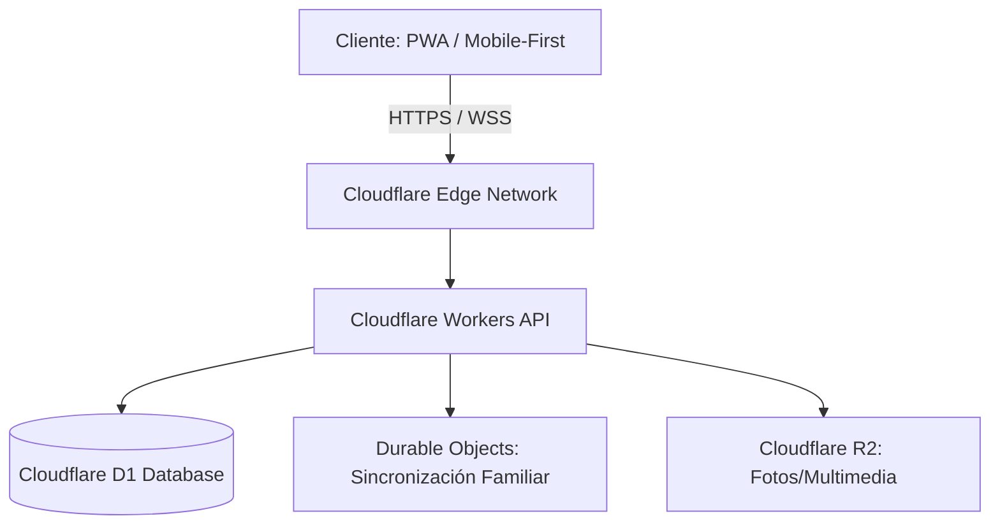

# Executive Summary - Mi Despensa

> [!WARNING]
> **ESTADO DE REFERENCIA:** Este documento ha sido auditado y contiene especificaciones parciales obsoletas respecto al MVP (como Durable Objects y WebSockets). La versión canónica y oficial de la arquitectura se detalla en [67_final_architecture_canonical_model.md](file:///d:/Desarrollos/web-api-midespensa/67_final_architecture_canonical_model.md). La organización responsable es **Bitera Digital SAS**.

## 1. Visión General del Negocio
**Mi Despensa** es una plataforma colaborativa digital diseñada para resolver un problema crítico en la gestión doméstica contemporánea: la ineficiencia, el desperdicio de alimentos y la falta de visibilidad del inventario de productos consumibles del hogar. Mediante una arquitectura orientada a la colaboración en tiempo real y el modelado predictivo, la solución proporciona una fuente única de verdad sobre las existencias, patrones de consumo y flujos financieros del hogar.

## 2. Propuesta de Valor
*   **Colaboración Familiar en Tiempo Real:** Sincronización instantánea de acciones de consumo y compra entre todos los integrantes del núcleo familiar.
*   **Reducción Activa del Desperdicio:** Notificaciones inteligentes basadas en fechas de caducidad y estimaciones de agotamiento.
*   **Optimización Financiera:** Historial detallado y comparación de precios que permiten planificar compras inteligentes y detectar variaciones de costo en el tiempo.
*   **Fricción Mínima de Entrada:** Escaneo ágil de códigos de barra (EAN/UPC) y códigos QR para automatizar el ingreso y egreso de productos.

## 3. Estrategia Tecnológica y Restricción Financiera
Para garantizar la viabilidad económica en su fase de lanzamiento B2C, la plataforma se diseña bajo un paradigma **Serverless / Edge-First** apalancando la suite de infraestructura de **Cloudflare**. 

Esta elección técnica asegura que la plataforma pueda escalar hasta miles de usuarios activos mensuales operando estrictamente dentro del **Free Tier** (Capa gratuita) de Cloudflare:
*   **Cloudflare Workers:** 100,000 peticiones diarias gratuitas.
*   **Cloudflare D1 (SQL Database):** Almacenamiento distribuido con lecturas/escrituras optimizadas sin costo base.
*   **Cloudflare R2:** Almacenamiento de assets sin costos de egreso (*egress fees*).
*   **Durable Objects / WebSockets:** Sincronización de bajo consumo en el Edge.

## 4. Compromiso de Cumplimiento y Privacidad
El tratamiento de datos familiares, patrones de compra y geolocalizaciones de consumo entraña un alto nivel de sensibilidad. Por tanto, el sistema se rige bajo los principios de **Privacy by Design** y **Zero Trust**, estructurando los flujos de datos para cumplir de forma nativa con la **Ley 18.331 (Uruguay)** y el **Reglamento General de Protección de Datos (GDPR)** de la Unión Europea.
