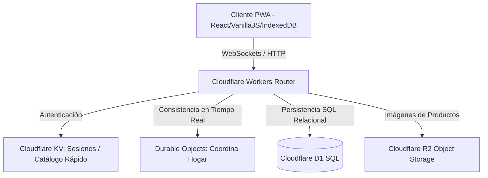
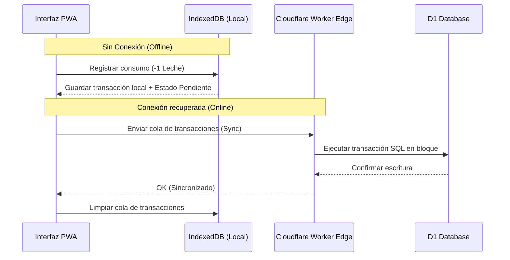

# System & Data Architecture - Mi Despensa

## 1. Arquitectura Conceptual (Cloudflare Edge Pattern)

La plataforma utiliza una topología distribuida de baja latencia basada en el Edge. Los servidores de aplicación tradicionales y bases de datos centralizadas son reemplazados por microservicios serverless distribuidos geográficamente en los puntos de presencia de Cloudflare.



### 1.1. Componentes Clave de Infraestructura
*   **Cloudflare Workers:** Maneja el enrutamiento de la API, ejecuta las reglas de negocio y procesa las llamadas HTTP con inicio frío (*cold start*) virtualmente nulo.
*   **Cloudflare Durable Objects:** Proporciona almacenamiento en memoria coordinado con consistencia fuerte en el Edge. Cada "Hogar" tiene asignado una instancia única de Durable Object que mantiene las conexiones WebSocket de los miembros del hogar activas para propagar cambios de stock de forma instantánea.
*   **Cloudflare D1 Database:** Base de datos relacional serverless basada en SQLite que almacena de manera persistente las tablas del inventario, usuarios y registros históricos de precios.
*   **Cloudflare R2 Storage:** Almacén de objetos compatible con la API de Amazon S3 donde se alojan las imágenes de los productos tomadas por los usuarios.

---

## 2. Modelo de Sincronización Offline-First

Dado que los usuarios pueden registrar consumos en sótanos o cocinas con mala recepción, se implementa una estrategia de consistencia eventual basada en un buffer local en la PWA.



---

## 3. Modelo de Datos (D1 Schema - Relational SQLite)

El esquema relacional implementa un aislamiento nativo por `tenant_id` (Hogar) para facilitar el cumplimiento regulatorio de privacidad.

```sql
-- Tabla de Hogares (Tenants)
CREATE TABLE hogares (
    id TEXT PRIMARY KEY,
    nombre TEXT NOT NULL,
    creado_en TIMESTAMP DEFAULT CURRENT_TIMESTAMP
);

-- Tabla de Usuarios
CREATE TABLE usuarios (
    id TEXT PRIMARY KEY,
    email TEXT UNIQUE NOT NULL,
    nombre TEXT NOT NULL,
    rol TEXT CHECK(rol IN ('ADMIN', 'MIEMBRO', 'INVITADO')) NOT NULL,
    hogar_id TEXT,
    FOREIGN KEY(hogar_id) REFERENCES hogares(id)
);

-- Tabla de Productos (Catálogo del Hogar)
CREATE TABLE productos (
    id TEXT PRIMARY KEY,
    hogar_id TEXT NOT NULL,
    nombre TEXT NOT NULL,
    codigo_barras TEXT,
    categoria TEXT,
    stock_actual REAL DEFAULT 0,
    stock_minimo REAL DEFAULT 1,
    stock_deseado REAL DEFAULT 2,
    unidad TEXT DEFAULT 'unidad',
    FOREIGN KEY(hogar_id) REFERENCES hogares(id)
);

-- Tabla de Vencimientos
CREATE TABLE vencimientos (
    id TEXT PRIMARY KEY,
    producto_id TEXT NOT NULL,
    fecha_vencimiento DATE NOT NULL,
    cantidad REAL NOT NULL,
    FOREIGN KEY(producto_id) REFERENCES productos(id) ON DELETE CASCADE
);

-- Historial de Compras y Precios
CREATE TABLE compras_historial (
    id TEXT PRIMARY KEY,
    hogar_id TEXT NOT NULL,
    producto_id TEXT NOT NULL,
    fecha_compra TIMESTAMP DEFAULT CURRENT_TIMESTAMP,
    cantidad REAL NOT NULL,
    precio_unitario REAL NOT NULL,
    moneda TEXT DEFAULT 'UYU',
    FOREIGN KEY(hogar_id) REFERENCES hogares(id),
    FOREIGN KEY(producto_id) REFERENCES productos(id)
);
```
