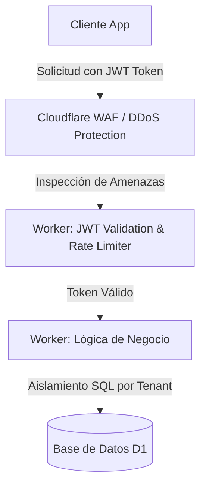

# Security, Privacy & Compliance - Mi Despensa

> [!WARNING]
> **ESTADO DE REFERENCIA:** Este documento ha sido auditado y contiene especificaciones de seguridad y criptografía parciales obsoletas (como la firma asimétrica de JWT RS256/ES256). La versión canónica y oficial de la arquitectura de seguridad, incluyendo el uso oficial de HS256 y la separación de Control/Data Plane, se detalla en [67_final_architecture_canonical_model.md](file:///d:/Desarrollos/web-api-midespensa/67_final_architecture_canonical_model.md).

La seguridad y la privacidad no son parches agregados al final del desarrollo; se diseñan e implementan en los cimientos del código y la infraestructura (*Security by Design* y *Privacy by Design*).

---

## 1. Arquitectura de Seguridad (Zero Trust en el Edge)

El acceso a la API e infraestructura de **Mi Despensa** sigue un modelo estricto de **Confianza Cero (Zero Trust)**:

### 1.1. Controles Técnicos Clave
*   **Autenticación sin Contraseñas (Passwordless):** Se implementa autenticación mediante Magic Links (tokens temporales criptográficamente firmados enviados por e-mail) o proveedores OAuth2 (Google/Apple). Esto reduce el riesgo de compromiso de bases de datos de contraseñas.
*   **Validación de Sesión (JWT):** Cada llamada a la API requiere un token JWT firmado mediante algoritmos de clave asimétrica (RS256/ES256) validado en tiempo de ejecución en el Worker más cercano al usuario.
*   **Rate Limiting Integrado:** Cloudflare Rate Limiting deniega tráfico abusivo ($>60$ solicitudes por minuto por dirección IP) para mitigar vectores de denegación de servicio (DDoS) y ataques de fuerza bruta.

---

## 2. Arquitectura de Privacidad (GDPR & Ley 18.331 Uruguay)

La plataforma recopila información sobre hábitos de consumo doméstico, lo cual califica como datos personales. Se definen las siguientes salvaguardas:

### 2.1. Minimización de Datos (Data Minimization)
El sistema recolecta únicamente los datos estrictamente necesarios para operar la despensa: correo electrónico para autenticación, nombre del usuario e inventario de productos. No se recopilan datos de geolocalización precisa en background ni información demográfica intrusiva.

### 2.2. Aislamiento Lógico y Row-Level Security
Todas las consultas SQL sobre la base de datos D1 inyectan obligatoriamente el filtro de clave externa de Hogar (`hogar_id = user_tenant_id`) extraído del payload del token JWT de sesión verificado. Esto impide fugas lógicas de datos cruzadas (*Horizontal Privilege Escalation* / *IDOR*).

### 2.3. Ejercicio de Derechos (ARCO / GDPR)
El sistema implementa endpoints específicos para dar cumplimiento a los derechos de los usuarios:
*   **Acceso y Portabilidad:** Exportación automática de todo el inventario e historial en formato JSON legible por máquina con un solo clic.
*   **Derecho al Olvido (Eliminación):** Al solicitar la eliminación de la cuenta de usuario, se borran en cascada todos los registros personales asociados en un plazo máximo de 72 horas hábiles. Si se elimina el "Hogar", se eliminan en cascada todos los registros del inventario del mismo en D1 y R2 de forma definitiva e irrecuperable.

---

## 3. Marcos de Cumplimiento (Compliance Framework)

Alineación metodológica con estándares internacionales:

*   **ISO/IEC 27001 (SGSI - Seguridad de la Información):** Configuración de un registro de activos de información en la nube y análisis de riesgos sistemático para asegurar que las variables de confidencialidad, integridad y disponibilidad estén controladas.
*   **ISO/IEC 27701 (PIMS - Privacidad):** Designación de un rol encargado de velar por la privacidad del ciclo de vida de los datos, documentando la trazabilidad del procesamiento.
*   **ISO 22301 (BCMS - Continuidad de Negocio):** Definición de planes de contingencia ante fallos críticos de Cloudflare, asegurando la conmutación offline local y copias de seguridad incrementales automatizadas de la base de datos D1 hacia almacenamiento alternativo de contingencia una vez al día.
