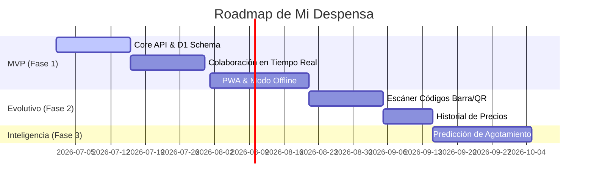

# Roadmap & Validation Framework - Mi Despensa

Este documento define el camino evolutivo para la construcción del producto y los métodos de auditoría/validación para asegurar que el sistema final cumpla con las expectativas técnicas y de negocio definidas.

---

## 1. Product Roadmap (Fases de Lanzamiento)

El desarrollo se prioriza utilizando la clasificación MoSCoW para lograr un tiempo de salida al mercado (*Time to Market*) óptimo.

### 1.1. MVP - Fase 1 (Core & Sincronización)
*   **Foco:** Garantizar que los miembros de un hogar puedan ver, añadir y quitar productos de forma segura, incluso offline.
*   **Entregables:**
    *   Backend en Cloudflare Workers con Base de Datos D1.
    *   Cliente PWA responsivo con IndexedDB.
    *   Flujo de invitación familiar segura.
    *   Lista de compras básica autogenerada por inventario bajo.

### 1.2. Evolución - Fase 2 (Facilidad & Finanzas)
*   **Foco:** Agilizar la carga de datos y agregar métricas económicas.
*   **Entregables:**
    *   Integración de escáner en frontend mediante `Shape Detection API` / `Barcode Detector`.
    *   Historial visual del producto (carga de imágenes a R2).
    *   Módulo de comparación e historial de precios pagados.

### 1.3. Optimización e Inteligencia - Fase 3
*   **Foco:** Analítica avanzada y recomendaciones.
*   **Entregables:**
    *   Notificaciones push de vencimiento cercano.
    *   Módulo predictivo basado en consumo medio ponderado.

---

## 2. Validation Framework (Mecanismos de Validación)

El cumplimiento de los Requerimientos No Funcionales y las normativas se validará antes del pase a producción mediante el siguiente marco de pruebas:

### 2.1. Validación de Rendimiento y Experiencia de Usuario (Performance)
*   **Métrica Objective:** Calificación Lighthouse en producción superior a **95/100** en rendimiento, accesibilidad, buenas prácticas y SEO.
*   **Core Web Vitals:**
    *   Largest Contentful Paint (LCP) $<1.5\text{s}$.
    *   Interaction to Next Paint (INP) $<50\text{ms}$.
    *   Cumulative Layout Shift (CLS) $<0.1$.

### 2.2. Validación de Seguridad y Encabezados (Security Audit)
*   **SSL Labs:** Calificación de **A+** obligatoria en la URL de la API mediante la configuración de TLS 1.3 estricto en el dashboard de Cloudflare.
*   **Security Headers:** Puntuación de **A+** validada por herramientas automatizadas. Esto requiere la correcta implementación de:
    *   `Content-Security-Policy` (CSP) restrictivo.
    *   `Strict-Transport-Security` (HSTS) con preload habilitado.
    *   `X-Content-Type-Options: nosniff`.
    *   `Referrer-Policy: strict-origin-when-cross-origin`.

### 2.3. Validación de Calidad y Continuidad (QA & BCP)
*   **Pruebas Unitarias y de Integración:** Cobertura de tests de integración para verificar el aislamiento de Tenants en D1 superior al **90%** ejecutados con Vitest / Jest.
*   **Prueba de Recuperación ante Desastres (Disaster Recovery Simulation):** Ejercicio semestral de restauración del backup de D1 en un entorno local y en un tenant de prueba para medir el RTO (Recovery Time Objective) de $<2\text{ horas}$ y el RPO (Recovery Point Objective) de $<24\text{ horas}$.
