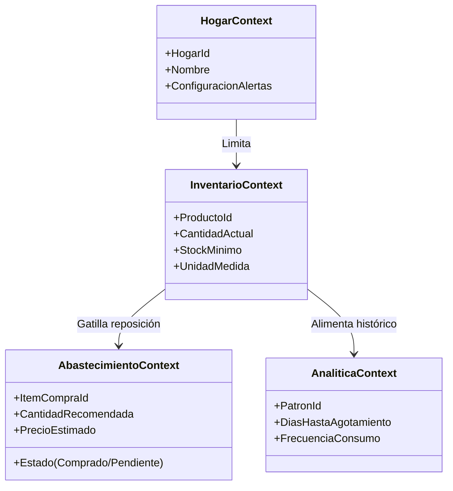

# Domain-Driven Product Vision & Evolutionary Architecture

Este documento detalla la estrategia de negocio y la arquitectura orientada al dominio (**Domain-Driven Design**) para **Mi Despensa**, asegurando que el diseño de software soporte el crecimiento funcional a largo plazo (ecosistema de gestión inteligente del hogar) sin requerir rediseños disruptivos de infraestructura.

---

## 1. Dominios de Negocio (Core, Supporting y Generic)

Para garantizar un acoplamiento débil (*loose coupling*) y una alta cohesión, organizamos las capacidades del sistema en dominios diferenciados:

```mermaid
graph TD
    subgraph Core Domains (Ventaja Competitiva e Inteligencia)
        D_Predicciones[Predicciones e Inteligencia]
        D_Inventario[Inventario y Alacenas]
        D_Consumo[Consumo e Historial]
    end
    
    subgraph Supporting Domains (Facilitadores de Negocio)
        D_Compras[Compras y Abastecimiento]
        D_Precios[Precios e Historial Financiero]
        D_Imagenes[Imágenes y Catálogo Visual]
    end
    
    subgraph Generic Domains (Comunes a Sistemas Enterprise)
        D_Hogar[Hogar / Tenant]
        D_Usuarios[Usuarios y Permisos]
        D_Familia[Familia / Colaboración]
    end
```

### 1.1. Core Domains
*   **Inventario:** El estado actual del stock doméstico (cantidad, vencimientos). Es el punto de partida transaccional.
*   **Consumo:** Registro del egreso de bienes y hábitos de uso temporal.
*   **Predicciones (Inteligencia):** El motor analítico encargado de calcular el agotamiento, estimar compras preventivas y detectar patrones anómalos.

### 1.2. Supporting Domains
*   **Compras:** La lista de reposición y control de tickets de compra físicos o digitales.
*   **Precios:** Base de datos financiera de fluctuación de precios de compra por ítem, comercio y fecha.
*   **Imágenes:** Asset management para reconocimiento visual.

### 1.3. Generic Domains
*   **Hogar (Multi-Tenancy):** Límite organizativo fundamental que define el aislamiento de los datos.
*   **Usuarios / Familia:** Gestión de perfiles de usuario, roles (Admin, Miembro, Invitado) y autenticación segura.

---

## 2. Bounded Contexts (Contextos Acotados) y Ubiquitous Language

Cada dominio de negocio se implementa dentro de límites explícitos donde los modelos de datos tienen significados inequívocos:



1.  **Hogar Context:** Encapsula el ciclo de vida del grupo familiar y sus reglas de membresía.
2.  **Inventario Context:** Su lenguaje ubicuo define qué es un *Producto*, su *Stock* y sus *Vencimientos*.
3.  **Abastecimiento Context (Compras y Precios):** Define la preparación del aprovisionamiento de stock. Aquí, un producto de la despensa se convierte en un *Ítem de Compra* con atributos financieros (precio unitario, moneda, establecimiento).
4.  **Analítica Context:** Se nutre de los historiales de consumo e inventario para generar *Predicciones* y *Recomendaciones*, totalmente aislado de la lógica transaccional de stock diaria.

---

## 3. Capacidades de Negocio (Business Capabilities Map)

| Capacidad | Descripción | Clasificación | Canal Tecnológico |
| :--- | :--- | :--- | :--- |
| **Monitoreo de Stock** | Visualización en tiempo real del inventario del hogar. | Core / Must-Have | API Edge / Durable Objects |
| **Colaboración Familiar** | Actualización bidireccional inmediata de consumos domésticos. | Core / Must-Have | WebSockets / DO |
| **Planificación Financiera** | Comparador de precios históricos por comercio y producto. | Supporting / Should-Have | D1 Analytics Query |
| **Pronóstico de Consumo** | Estimaciones autónomas de agotamiento de insumos domésticos. | Core / Could-Have (F3) | Workers AI / ML Ligero |

---

## 4. Evolución Prevista a 3 Años

*   **Año 1: Transaccionalidad y Consolidación del Historial (MVP + F2).** Foco en capturar el flujo de datos del hogar: stock actual, ingresos (compras) y egresos (consumos). Se sientan las bases de almacenamiento del histórico estructurado.
*   **Año 2: Inteligencia Localizada e Integraciones (F3).** Introducción de algoritmos de analítica en el Edge (ej. Cloudflare Workers AI) para predecir reposición basados en el historial del Año 1. Integración de APIs de catálogos y sistemas de precios públicos.
*   **Año 3: Ecosistema Inteligente del Hogar (Más allá de la despensa).** Expansión hacia dominios conexos (ej. control de consumos de servicios, control de tareas del hogar, integración con electrodomésticos inteligentes o IoT) reutilizando los contextos de *Hogar Context* y *Usuarios Context*.

---

## 5. Riesgos de Escalabilidad Funcional e Impacto Arquitectónico

### Riesgo: Contaminación de Contextos
*   *Descripción:* Que la lógica de predicciones analíticas e inteligencia requiera modificaciones directas en la tabla relacional de inventario activo.
*   *Mitigación:* Aislamiento de base de datos a nivel físico o lógico. Las lecturas de consumo se envían de forma asíncrona hacia almacenamiento analítico (ej. Event Sourcing mediante Cloudflare Queues), evitando acoplar la API transaccional rápida al motor predictivo.

---

## 6. Estrategia para Evitar Rediseños Arquitectónicos Futuros

1.  **Event-Driven Architecture (EDA) interna:** Cada cambio en el inventario (+1, -1, alta) genera un evento de dominio (`StockIncrementado`, `StockAgotado`, `PrecioRegistrado`). La API transaccional procesa el comando e inmediatamente publica el evento en una cola (**Cloudflare Queues**).
2.  **Suscripción asíncrona:** Los contextos de *Analítica* y *Abastecimiento* escuchan la cola de eventos en background para actualizar las proyecciones históricas sin degradar el tiempo de respuesta del cliente.
3.  **Aislamiento en el Almacenamiento (Durable Objects + D1):**
    *   **Durable Objects** maneja el estado transaccional volátil en memoria e inmediato (coordinación activa del hogar).
    *   **D1** persiste la base estructurada relacional y el histórico agregado.
    *   **R2** almacena assets binarios sin sobrecargar las cuotas de base de datos.
