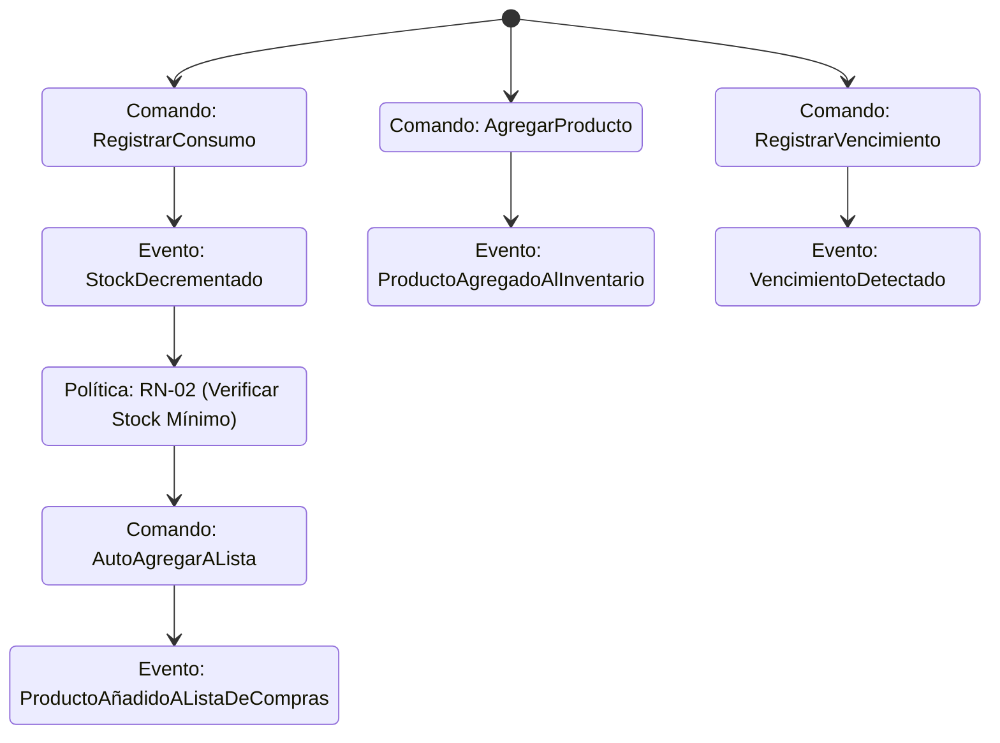

# Event Storming - Mi Despensa

Este documento establece el modelo de eventos, comandos, políticas y procesos críticos para los dominios de **Mi Despensa**, simulando el resultado de una sesión de *Event Storming*.

---

## 1. Leyenda del Modelo de Event Storming

*   **Domain Event (Naranja):** Algo que ya ocurrió en el dominio (verbo en pasado).
*   **Command (Azul):** Acción iniciada por un usuario o sistema que desencadena un evento.
*   **Policy / Rule (Gris/Violeta):** Reacción automática ante un evento ("Cuando ocurra X, entonces hacer Y").
*   **Read Model (Verde):** Vista optimizada para la UI de los usuarios.
*   **External System (Rosa):** Sistema fuera del control del dominio (ej. pasarelas de pago, APIs de supermercado).
*   **Hot Spot (Rojo):** Zona de alta complejidad, riesgo o ambigüedad.

---

## 2. Dominio: Inventario & Consumo (Core)

### 2.1. Eventos y Comandos
*   **Command:** `RegistrarConsumo` (Usuario) $\rightarrow$ **Domain Event:** `ConsumoRegistrado` / `StockDecrementado`.
*   **Command:** `RegistrarIngreso` (Usuario) $\rightarrow$ **Domain Event:** `IngresoRegistrado` / `StockIncrementado`.
*   **Command:** `CorregirStock` (Usuario/Admin) $\rightarrow$ **Domain Event:** `StockCorregido`.

### 2.2. Políticas (Policies)
*   **Policy (Reabastecimiento Automático):** Cuando ocurra `StockDecrementado`, si el $Stock\_Actual \le Stock\_Minimo$, ejecutar el comando `AñadirAListaDeCompras`.
*   **Policy (Alerta de Desperdicio):** Cuando ocurra `VencimientoDetectado` (vía proceso batch diario), si la fecha actual está dentro del umbral, ejecutar comando `EnviarAlertaDeVencimiento`.

### 2.3. Read Models (Modelos de Lectura)
*   `DashboardInventarioView`: Lista consolidada de ítems con stock actual, categoría e indicador visual de fecha de vencimiento más próxima.

### 2.4. Hot Spots (Puntos Calientes / Riesgos)
*   🔥 **Sincronización Multidispositivo Offline:** ¿Qué sucede si dos usuarios decrementan el mismo producto simultáneamente sin internet? (Ver resolución LWW en diseño de datos).

---

## 3. Dominio: Compras & Precios (Supporting)

### 3.1. Eventos y Comandos
*   **Command:** `RegistrarCompra` (Usuario) $\rightarrow$ **Domain Event:** `CompraCompletada`.
*   **Command:** `ActualizarPrecioDeReferencia` (Sistema) $\rightarrow$ **Domain Event:** `PrecioDeReferenciaModificado`.

### 3.2. Políticas
*   **Policy (Actualización de Stock por Compra):** Cuando ocurra `CompraCompletada`, ejecutar el comando `IncrementarStock` por cada producto adquirido en la transacción.
*   **Policy (Histórico de Precios):** Cuando ocurra `CompraCompletada`, ejecutar el comando `RegistrarHistoricoDePrecio` con el valor unitario y el comercio especificados.

### 3.3. External Systems
*   **CatalogoCodigosBarras (External API):** Utilizado para resolver marcas y nombres de productos desconocidos a partir de su EAN/UPC.

---

## 4. Procesos Críticos

### 4.1. Cierre de Compra y Reposición
1.  El usuario selecciona los ítems de la `Lista de Compras` física u online y presiona "Completar Compra".
2.  Se despacha el comando `CompletarCompra`.
3.  Se publica el evento `CompraCompletada`.
4.  La política de abastecimiento gatilla múltiples comandos `RegistrarIngreso` en el inventario.
5.  Se limpian los ítems de la lista de compras del hogar (`ListaDeComprasLimpiada`).
