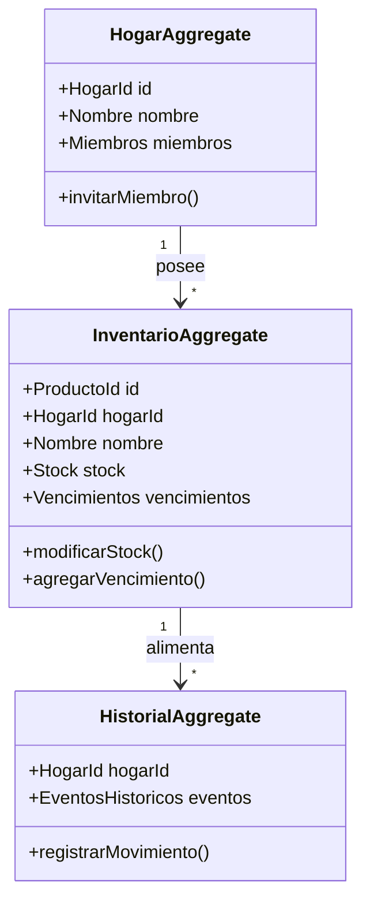

# Domain Model - Mi Despensa

Este documento detalla el modelo de dominio conceptual, identificando entidades, objetos de valor (*Value Objects*), agregados e invariantes que garantizan la integridad de las reglas del negocio de **Mi Despensa**.

---

## 1. Mapa de Agregados del Sistema

---

## 2. Definición de Elementos del Dominio

### 2.1. Agregado: Hogar (Aggregate Root)
*   **Definición:** Delimita el espacio de colaboración familiar y el aislamiento multi-tenant.
*   **Entidades:**
    *   `Hogar` (Aggregate Root): Identificado de manera única mediante un UUID.
    *   `Usuario`: Representa un miembro registrado en la plataforma.
*   **Value Objects:**
    *   `Rol`: Enumerable que define privilegios (`ADMIN`, `MIEMBRO`, `INVITADO`).
    *   `CodigoInvitacion`: Token temporal seguro para unir miembros al hogar.
*   **Invariantes:**
    *   Un Hogar debe tener al menos un usuario con el rol de `ADMIN`.
    *   Los miembros invitados no pueden invitar a otros usuarios ni eliminar el hogar.

### 2.2. Agregado: Inventario (Aggregate Root)
*   **Definición:** Controla las existencias físicas de los insumos domésticos.
*   **Entidades:**
    *   `Producto` (Aggregate Root): Identifica un insumo de consumo del hogar.
    *   `LoteVencimiento`: Representa un grupo de unidades del producto asociadas a una fecha específica de caducidad.
*   **Value Objects:**
    *   `Stock`: Cantidad actual, cantidad mínima y cantidad deseada de reposición.
    *   `CodigoBarras`: Representación tipada de códigos EAN-13, UPC o códigos QR.
    *   `UnidadMedida`: Enumerable (`gramos`, `litros`, `unidades`, `packs`).
*   **Invariantes:**
    *   El `Stock.cantidadActual` nunca puede ser un valor negativo (menor a cero).
    *   La fecha de vencimiento de un `LoteVencimiento` debe ser mayor o igual a la fecha de ingreso en el sistema.

### 2.3. Agregado: Historial (Aggregate Root)
*   **Definición:** La bitácora histórica inmutable de comportamiento, precios y consumo familiar.
*   **Entidades:**
    *   `BitacoraHistorica` (Aggregate Root): Registro lineal e inmutable de eventos pasados del hogar.
*   **Value Objects:**
    *   `TransaccionPrecio`: Representa la relación entre el precio pagado, la moneda de la transacción, el comercio emisor y la fecha.
    *   `RegistroMovimiento`: Detalle de quién consumió o ingresó qué producto, cuándo y bajo qué contexto.

---

## 3. Invariantes Globales de Negocio
1.  **Aislamiento Estricto:** Ninguna operación de lectura, escritura o predicción puede relacionar entidades pertenecientes a distintos `HogarId`.
2.  **Inmutabilidad del Histórico:** Los registros del `HistorialAggregate` no admiten actualizaciones (*updates*) ni borrados (*deletes*). Solo se añaden nuevas transacciones (*append-only*).
