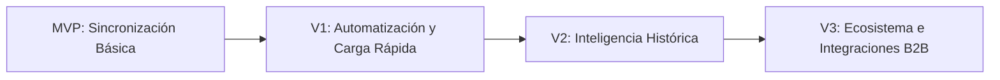

# Release Strategy - Mi Despensa

Estrategia evolutiva de lanzamientos por incrementos para estructurar la maduración de la plataforma.

---

## 1. Plan de Lanzamientos

### 1.1. MVP - Sincronización del Inventario Doméstico
*   **Objetivo:** Validar la retención y la utilidad de la sincronización en tiempo real del inventario del hogar.
*   **Funcionalidades:** Registro/Login por Magic Link, panel del Hogar, CRUD de productos, botones rápidos de stock, IndexedDB (Offline) y Lista de compras dinámica.
*   **Riesgos:** Fricción en la carga inicial de datos.

### 1.2. V1 - Automatización de Carga y Multimedia
*   **Objetivo:** Reducir la fricción de entrada de datos a menos de 5 segundos por producto.
*   **Funcionalidades:** Escáner de código de barras nativo (Shape Detection API), subida de fotos de productos a Cloudflare R2, registro manual de precio de adquisición y comercio de compra.
*   **Dependencia:** MVP estable.
*   **Riesgos:** Incremento en los costos de egreso de datos y cuota de R2 si no se optimiza el tamaño de las fotos en el cliente.

### 1.3. V2 - Inteligencia Histórica e Insights
*   **Objetivo:** Convertir el histórico inmutable de consumo en sugerencias de ahorro y predicción de reposición.
*   **Funcionalidades:** Notificaciones de vencimiento, estimación de agotamiento de stock basada en consumo promedio y comparador de precios históricos por comercio.
*   **Dependencia:** V1 activa con al menos 30 días de recolección de historiales de compra y consumo.

### 1.4. V3 - Ecosistema e Integraciones B2B
*   **Objetivo:** Habilitar monetización y salida del mercado doméstico puro.
*   **Funcionalidades:** Integración con APIs de supermercados locales para compra con un clic, importación de facturas digitales y soporte multi-hogar.
