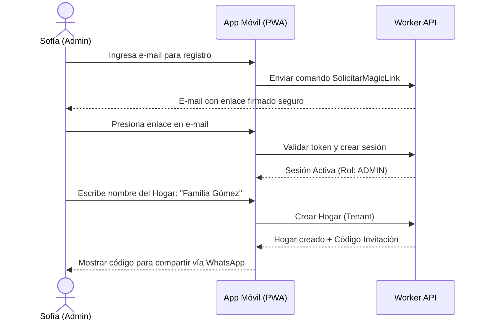

# User Journeys - Mi Despensa

Detalle de las secuencias de interacción clave de los usuarios con la plataforma en escenarios cotidianos.

---

## 1. Journey: Primer Ingreso y Creación del Hogar

---

## 2. Journey: Consumo de Producto (Alacena)
*   **Contexto:** Martín va a la cocina y toma el último paquete de fideos.
*   **Acciones:**
    1.  Abre la aplicación en su pantalla de inicio (PWA instalada).
    2.  Presiona el botón `-1` al lado del icono de Fideos en el panel principal.
    3.  La interfaz le muestra una animación de decremento exitoso.
    4.  *Tras bambalinas:* El stock cae a 0. Como el stock mínimo configurado es 1, la aplicación notifica de inmediato a la base de datos de compras, agregando "Fideos" a la lista de compras del hogar de forma reactiva.

---

## 3. Journey: Consulta en el Supermercado y Compra
*   **Contexto:** Sofía está en el supermercado y no recuerda qué falta en la alacena.
*   **Acciones:**
    1.  Abre la app y se dirige a la sección **Lista de Compras**.
    2.  Ve que se solicita "Fideos" (agregado por Martín hace unas horas) y "Leche".
    3.  Añade los ítems físicos a su carro de compras real.
    4.  En la app, presiona la casilla de verificación al lado de cada ítem de la lista.
    5.  Presiona "Finalizar Compra" e ingresa el precio pagado por unidad.
    6.  *Tras bambalinas:* La lista de compras se limpia. El inventario activo del hogar se incrementa con el nuevo stock de forma instantánea.
    7.  Los precios unitarios pagados se registran de forma inmutable en el historial financiero.
