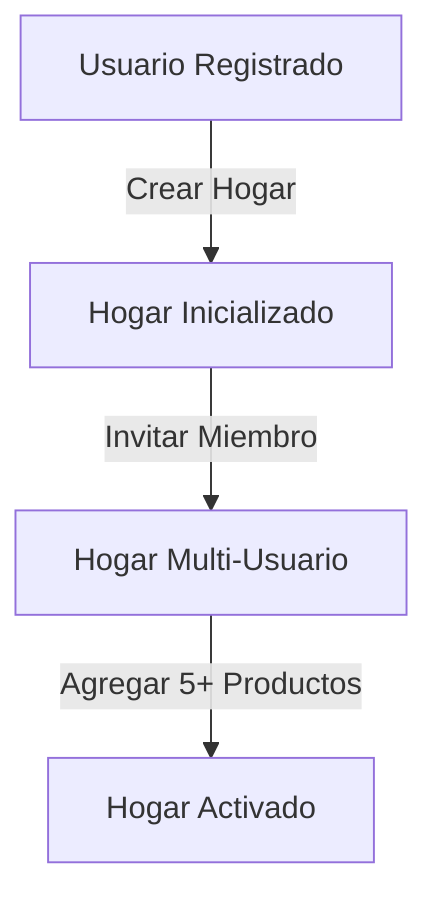

# Product Analytics Framework - Mi Despensa

Estructura de rastreo de analítica para registrar interacciones del usuario y transformarlas en decisiones de producto basadas en evidencia.

---

## 1. Esquema de Eventos de Producto

Para evitar fugas de privacidad (compliance inicial), la analítica recopila acciones funcionales anonimizadas y agregadas por `hogar_id` codificado, sin enviar datos de correos electrónicos ni nombres de usuarios a plataformas externas.

| Categoría | Nombre del Evento | Parámetros Clave | Relación con KPI |
| :--- | :--- | :--- | :--- |
| **Negocio** | `inventario_producto_creado` | `categoria`, `tiene_fecha_venc` | Mide la Activación del Hogar |
| **Comportamiento**| `stock_decrementado` | `origen (dashboard/offline)` | North Star Metric (WAC) |
| **Comportamiento**| `compra_completada` | `cantidad_items`, `tiene_precios` | Adopción de la Lista de Compras |
| **Rendimiento** | `sync_offline_completada`| `duracion_ms`, `cantidad_eventos` | KPI de Calidad Técnica |

---

## 2. Embudos de Conversión (Funnels)

### 2.1. Embudo de Activación del Hogar (A1)

*   *Métrica de Fuga:* Porcentaje de caída (*drop-off*) entre el registro y la invitación del segundo miembro. Si esta brecha supera el 50%, se simplificará el proceso de invitación (generando códigos QR directos).

### 2.2. Embudo de Retención y Valor
*   *Análisis de Cohortes:* Medición del porcentaje de usuarios que ejecutan el evento `stock_decrementado` o `compra_completada` de forma sostenida a lo largo de las semanas 1, 2, 3 y 4.
