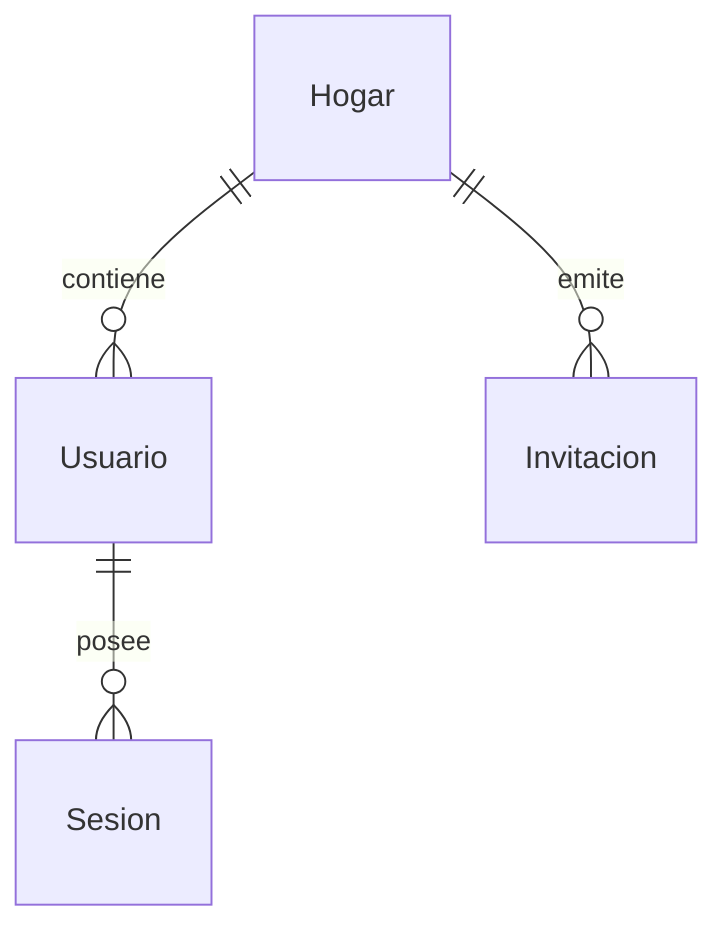

# Identity & Access Architecture - Mi Despensa

Especificación de la gestión de identidad, control de accesos y la estrategia de autenticación para la plataforma **Mi Despensa**.

---

## 1. Modelo de Identidad (Hogares y Usuarios)

El sistema opera bajo un modelo de aislamiento relacional estricto basado en Hogar (Tenant).

### 1.1. Roles y Permisos (RBAC)
*   **ADMIN (Creador del Hogar):** Puede invitar miembros, remover usuarios, editar parámetros globales del Hogar y solicitar la eliminación total del inventario/Hogar.
*   **MIEMBRO (Familiar):** Puede ver inventario, registrar consumos (-1), modificar stock y actualizar la lista de compras.
*   **INVITADO (Cuidador temporal):** Acceso únicamente de lectura sobre el inventario y lista de compras. No puede invitar miembros.

---

## 2. Evaluación de Mecanismos de Autenticación

| Mecanismo | Beneficios | Costos y Complejidad | Compatibilidad Presupuesto Cero | Decisión / Justificación |
| :--- | :--- | :--- | :--- | :--- |
| **Magic Links** (E-mail OTP) | Sin contraseñas, excelente UX móvil. | Requiere integración con API de correo electrónico externa. | **Excelente** (ej. capa gratuita de Resend de 3k envíos). | **Aprobado para MVP.** Permite un despliegue inmediato. |
| **Passkeys / WebAuthn** | Criptografía asimétrica local, seguro contra phishing. | Alta complejidad de implementación inicial y soporte irregular en navegadores web en PWA. | **Excelente** (autenticación directa en cliente/Worker). | **Aprobado para V1 (Evolución).** Se ofrecerá como mejora de seguridad. |
| **MFA (TOTP/SMS)** | Capa extra de protección. | Costo financiero en SMS. TOTP añade fricción a usuarios domésticos no técnicos. | Medio. | **Descartado para MVP/V1.** No se ajusta al perfil B2C de bajo esfuerzo técnico. |

---

## 3. Proceso de Invitación Seguro
1.  El `ADMIN` solicita generar un enlace de invitación.
2.  La API del Worker genera un código criptográficamente firmado y temporal (`CodigoInvitacion`), con vencimiento de 48 horas.
3.  El nuevo usuario utiliza el enlace y se asocia al `hogar_id` correspondiente previa validación de su identidad por Magic Link.
