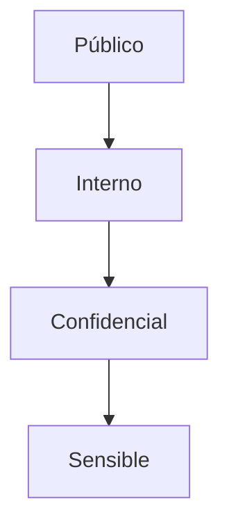

# Data Classification Framework - Mi Despensa

Define los niveles de sensibilidad de la información procesada por la plataforma y las reglas de manejo requeridas para cumplir con GDPR y la Ley 18.331 de Uruguay.

---

## 1. Niveles de Clasificación de Datos

### 1.1. Datos Públicos (L1)
*   *Definición:* Información que no daña a la empresa ni a los usuarios si se expone de forma pública.
*   *Mapeo:* Catálogo maestro general de códigos de barra (nombres de marcas y categorías generales de productos).

### 1.2. Datos Internos (L2)
*   *Definición:* Métricas de uso de la plataforma agregadas y anonimizadas de forma colectiva.
*   *Mapeo:* Conteo total de hogares activos, promedios generales de retención y volumen de transacciones de stock diarias globales.

### 1.3. Datos Confidenciales (L3)
*   *Definición:* Información que pertenece a un Hogar específico y cuya exposición no autorizada compromete la privacidad del núcleo familiar.
*   *Mapeo:* Inventario actual de la alacena, stock restante, listas de compras generadas, fotos de productos y nombres de marcas particulares consumidas.

### 1.4. Datos Sensibles (L4)
*   *Definición:* Información de identificación personal (PII) o registros financieros directos del hogar.
*   *Mapeo:* Correo electrónico del usuario, tokens JWT de sesión activa, historial financiero de precios pagados por establecimiento de compra y marcas de tiempo precisas de consumo (hábitos de vida cotidianos).

---

## 2. Requerimientos de Manejo por Nivel

| Nivel | Almacenamiento | Cifrado en Tránsito | Cifrado en Reposo | Retención |
| :--- | :--- | :--- | :--- | :--- |
| **L1 (Público)** | Cloudflare KV / D1 | TLS 1.3 | AES-256 | Indefinido |
| **L2 (Interno)** | D1 Analytics | TLS 1.3 | AES-256 | Indefinido |
| **L3 (Confidencial)**| D1 (Aislado por tenant) | TLS 1.3 | AES-256 | Vida del Hogar |
| **L4 (Sensible)** | D1 (Aislado por tenant) | TLS 1.3 | AES-256 + Hash en tokens | Hasta baja de cuenta |
