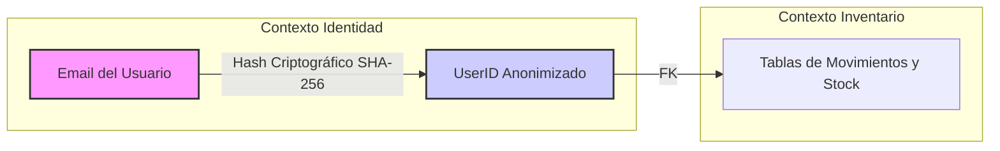

# Privacy Architecture - Mi Despensa

Especificación de la arquitectura de privacidad basada en los principios de *Privacy by Design* y *Privacy by Default*.

---

## 1. Tratamiento de Información de Identificación Personal (PII)

Para minimizar la retención de datos sensibles, se implementa una estrategia de desacoplamiento de identidades:

*   **Pseudonimización de Registros:** Los nombres reales de los integrantes se asocian lógicamente a un alias local dentro del Hogar. La base de datos D1 del Worker maneja las transacciones y estadísticas asociadas a un identificador criptográfico (`user_id`), impidiendo que una brecha en la tabla de inventarios exponga de forma inmediata qué consumió una dirección de e-mail concreta.

---

## 2. Flujo de Derechos ARCO y GDPR

### 2.1. Derecho de Portabilidad
*   *Implementación técnica:* Endpoint `/api/v1/hogar/exportar` protegido por JWT. Ejecuta una consulta SQL unificada en D1 que retorna un payload JSON estructurado con el catálogo de productos, compras e histórico financiero del Hogar.

### 2.2. Derecho al Olvido (Eliminación Definitiva)
*   *Implementación técnica:* Al solicitar la eliminación de la cuenta de usuario, se activa un trigger en D1 que realiza una eliminación física en cascada:
    1.  Se eliminan las sesiones activas en KV.
    2.  Se borra la fila del usuario en la tabla `usuarios`.
    3.  Si el usuario era el único `ADMIN` del hogar, se procede a eliminar la tabla del hogar (`hogares`) y los productos y vencimientos asociados en cascada en un plazo máximo de 72 horas.
    4.  Se eliminan las imágenes de productos subidos por ese hogar en R2 de forma definitiva.
