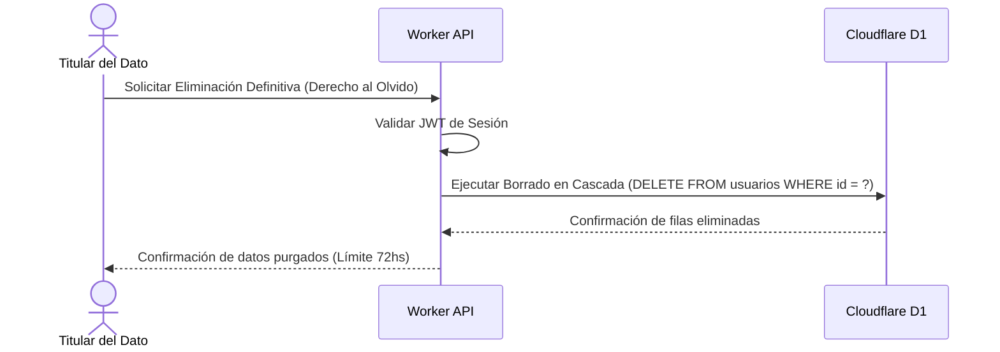

# PIMS Blueprint (ISO/IEC 27701) - Mi Despensa

Diseño del Sistema de Gestión de la Privacidad de la Información (PIMS) adaptado a las regulaciones GDPR y la Ley 18.331 de Uruguay.

---

## 1. Inventario de Datos Personales (PII Inventory)
*   **Identificador Directo:** Correo electrónico del usuario (utilizado únicamente para el envío del token de Magic Link).
*   **Identificadores Derivados:** Historial de consumo temporalizado, registro de compras y precios de transacciones físicas, asociados de manera indirecta a través del `user_id` cifrado.

---

## 2. Bases Legales del Procesamiento

El tratamiento de los datos personales en **Mi Despensa** se fundamenta en las siguientes bases legítimas:

1.  **Consentimiento Explícito del Titular (GDPR Art 6.1.a / Ley 18.331 Art 9):** Otorgado de forma obligatoria durante el registro de la cuenta mediante la aceptación activa y granular del tratamiento del historial de despensa para generar listas de compras.
2.  **Ejecución de un Contrato (GDPR Art 6.1.b):** El procesamiento de stock e inventario es estrictamente necesario para proveer la funcionalidad principal de la plataforma al usuario final.

---

## 3. Flujo de Atención a Derechos de Privacidad (ARCO)

*   **Gobernanza de Purga:** El borrado de la PII de la base relacional D1 es de carácter irreversible y físico, destruyendo los registros históricos asociados de forma inmediata del almacén activo en el Edge.
