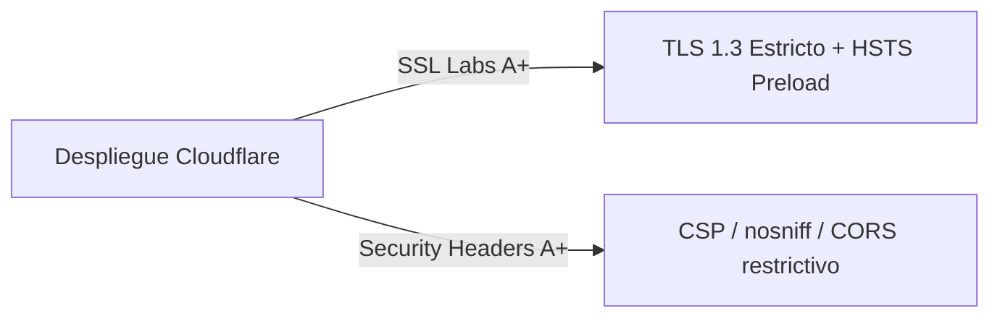

# External Validation Framework - Mi Despensa

Especificación de las directrices y configuraciones necesarias para certificar externamente la seguridad de la plataforma a nivel de red y transporte.

---

## 1. Validaciones Externas de Seguridad

Para garantizar un diseño *Security by Design* acreditable ante auditores externos, la infraestructura del dominio debe ser validada contra los siguientes marcos externos:

### 1.1. SSL Labs (Target: A+)
*   **Configuración en Edge:** Desactivar soporte de TLS 1.0 y 1.1. Habilitar únicamente TLS 1.2 y TLS 1.3 con cipher suites seguras (ej. `ECDHE-ECDSA-AES128-GCM-SHA256`).
*   **HSTS:** Configurar encabezado `Strict-Transport-Security` con valor `max-age=63072000; includeSubDomains; preload` para forzar la navegación HTTPS y posibilitar la inclusión en el listado de precarga de los navegadores web.

### 1.2. Security Headers (Target: A+)
El Cloudflare Worker debe retornar de manera obligatoria en todas sus respuestas HTTP los siguientes encabezados de seguridad:
*   `Content-Security-Policy (CSP)`: Restringido a scripts y estilos autohospedados (`default-src 'self'`).
*   `X-Frame-Options: DENY` (Evita secuestro de clics / *Clickjacking*).
*   `X-Content-Type-Options: nosniff` (Evita ataques de sniffing de tipos MIME).
*   `Referrer-Policy: strict-origin-when-cross-origin`.
