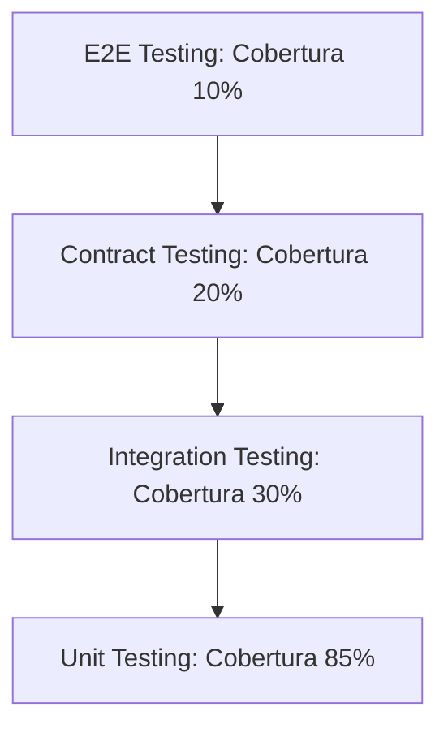

# Testing Strategy - Mi Despensa

Estrategia multinivel de pruebas de software para certificar el correcto funcionamiento funcional y técnico del sistema.

---

## 1. Pirámide de Pruebas y Cobertura

### 1.1. Unit Testing (Pruebas Unitarias)
*   **Foco:** Validar la lógica de negocio pura y aislada (ej. cálculo del estado de stock, alertas de vencimiento, reglas de adición a la lista de compras).
*   **Target Cobertura:** $\ge 85\%$ de las líneas de código.

### 1.2. Integration Testing (Pruebas de Integración)
*   **Foco:** Validar el comportamiento de las consultas e inserciones SQL contra un entorno SQLite simulado (equivalente a D1) y el aislamiento por `hogar_id`.
*   **Target Cobertura:** 30% de los flujos de la API.

### 1.3. Contract Testing (Pruebas de Contrato)
*   **Foco:** Asegurar la compatibilidad semántica entre el backend (API en el Edge) y el cliente PWA para evitar caídas de compatibilidad en despliegues desacoplados.

### 1.4. End-to-End (E2E) Testing
*   **Foco:** Simulación de flujos de usuario reales (ej. registro, decremento de stock y ver actualización de lista) utilizando navegadores automatizados en un entorno de pruebas idéntico al productivo.
