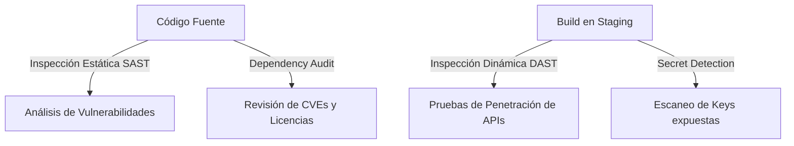

# Security Validation Framework - Mi Despensa

Estructura de validación e inspección automatizada y manual de la seguridad física y lógica del código.

---

## 1. Niveles de Inspección de Seguridad

La validación se alinea con el estándar **OWASP ASVS (Application Security Verification Standard) Nivel 1** (aplicable a aplicaciones de consumo masivo):

### 1.1. Análisis Estático (SAST)
*   **Foco:** Escanear el código JavaScript/TypeScript de la API de Workers en busca de patrones vulnerables, inyecciones de parámetros y malas prácticas de tipado.

### 1.2. Detección de Secretos (Secret Detection)
*   **Foco:** Evitar la confirmación accidental de claves de Cloudflare, tokens de API de Resend o secretos de bases de datos en los repositorios Git.

### 1.3. Auditoría de Dependencias (Dependency Audit)
*   **Foco:** Inspeccionar que ningún paquete de npm importado contenga vulnerabilidades críticas (CVEs de severidad Alta o Crítica).
