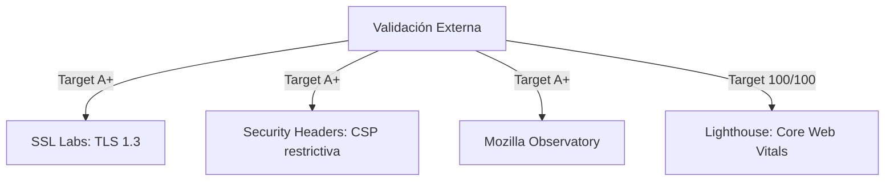

# External Quality Targets - Mi Despensa

Plan detallado para asegurar las calificaciones de calidad técnica óptimas y acreditadas por entidades auditoras externas.

---

## 1. Puntuaciones Objetivo de Calidad Externa

El sistema se auditará de manera automatizada contra los siguientes estándares:

### 1.1. Seguridad y Cabeceras (SSL Labs / Security Headers / Mozilla Observatory)
*   **SSL Labs A+:** Habilitar TLS 1.3 estricto en la capa de Cloudflare. Habilitar soporte de HSTS con opción de precarga (*preload*).
*   **Security Headers A+:** El Worker debe incluir la cabecera `Content-Security-Policy` restrictiva, `X-Content-Type-Options: nosniff`, `X-Frame-Options: DENY` y `Referrer-Policy: strict-origin-when-cross-origin`.

### 1.2. Rendimiento y SEO (Lighthouse / PageSpeed)
*   **Lighthouse Performance (Target: $\ge 95/100$):** Optimizado mediante compresión Brotli en Cloudflare, minimización de código, carga diferida (*lazy loading*) de rutas e imágenes del cliente, y Service Workers eficientes.
*   **SEO & Accesibilidad (Target: $100/100$):** Estructura HTML5 limpia, metadatos y etiquetas descriptivas obligatorias en la cabecera del documento, y contraste WCAG AA validado por herramientas en tiempo de build.
