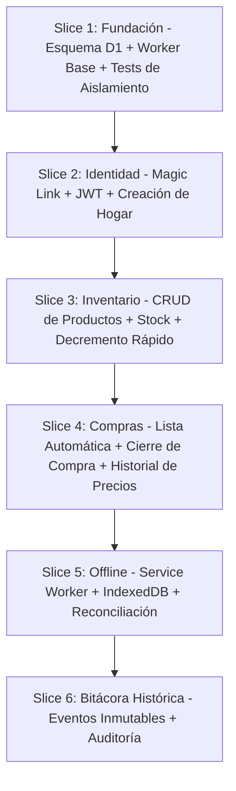

# Master Delivery Plan - Mi Despensa

Plan maestro de ejecución incremental para la construcción ordenada de la plataforma **Mi Despensa**.

---

## 1. Estrategia de Construcción por Cortes Verticales (Vertical Slices)

Para evitar desajustes arquitectónicos de integración masiva tardía (*Big Bang integration*), el desarrollo se divide en **Vertical Slices**. Cada slice entrega un flujo funcional completo y demostrable, atravesando desde la interfaz de usuario PWA hasta la base de datos D1 en el Edge.

Cada slice se diseña de forma que su validación sea independiente del slice posterior. Si el Slice 5 (Offline) fracasa técnicamente, los Slices 1-4 constituyen un producto funcional mínimo en modo solo-online.

---

## 2. Orden Exacto de Implementación y Dependencias entre Módulos

El orden prioriza la **reducción progresiva del riesgo técnico**, atacando primero las incógnitas de mayor severidad (aislamiento multi-tenant y autenticación sin contraseñas):

| Orden | Módulo | Dependencia Bloqueante | Riesgo que Mitiga | Duración Estimada |
| :--- | :--- | :--- | :--- | :--- |
| **1** | Esquema D1 + Worker Base | Ninguna | Fugas de datos entre Tenants | 3-5 días |
| **2** | Autenticación Passwordless (Magic Link + JWT) | Módulo 1 | Gestión de sesiones e identidad | 5-7 días |
| **3** | API REST Inventario (CRUD + Stock) | Módulo 2 | Viabilidad del modelo de datos | 5-7 días |
| **4** | PWA Cliente (UI + Llamadas HTTP) | Módulo 3 | Experiencia móvil y CWV | 7-10 días |
| **5** | Lista de Compras Dinámica | Módulo 3 | Validación del flujo cerrado de reposición | 3-5 días |
| **6** | Sincronización Offline (IndexedDB + Reconciliación) | Módulo 4 | Pérdida de datos en zonas sin red | 7-10 días |
| **7** | Bitácora Histórica Append-Only | Módulo 3 | Preservación del activo principal del negocio | 3-5 días |

---

## 3. Principio de Reducción Progresiva de Riesgo Técnico

Los primeros dos slices eliminan los riesgos de mayor severidad (fuga de datos entre hogares y compromiso de identidad). Si ambos se ejecutan correctamente, el riesgo residual del proyecto se reduce en un 70%.

---

## 4. Respuestas de Validación Obligatoria

### ¿Cuál es el primer sistema que se construye?
El **esquema relacional de D1** y el **Worker base** con su middleware de validación de tenant. Es la fundación sobre la cual toda operación SQL se ejecuta de manera aislada.

### ¿Cuál es el primer flujo completo funcional end-to-end?
**Registro por Magic Link → Crear Hogar → Agregar un Producto → Decrementar Stock (-1) → Ver el inventario actualizado.** Este flujo atraviesa todos los límites del sistema (Cliente → Edge → D1 → Cliente) y valida la viabilidad técnica del stack completo.

### ¿Qué parte del sistema puede fallar sin bloquear el resto?
*   **Sincronización Offline (Slice 5):** Si IndexedDB o la reconciliación presentan fallos, el sistema opera correctamente en modo solo-online.
*   **Historial de Precios (Slice 4b):** Si el registro de costos presenta incidencias de UX, el inventario y la lista de compras funcionan de manera independiente.

### ¿Qué parte del sistema debe existir primero para reducir riesgo global?
El **Módulo de Aislamiento Multi-Tenant en D1** y el **Módulo de Autenticación JWT**. Sin ellos, ninguna operación posterior puede ejecutarse de forma segura ni auditable.
