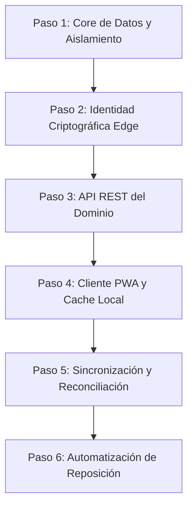

# 52_mvp_build_sequence.md — Secuencia de Construcción del MVP

Este documento define la secuencia técnica exacta y ordenada para el desarrollo y despliegue del Mínimo Producto Viable (MVP) de **Mi Despensa**. La prioridad fundamental es la mitigación temprana de riesgos estructurales (seguridad y persistencia relacional) antes de abordar la interfaz de usuario o las capacidades avanzadas de automatización.

---

## 1. Secuencia de Construcción por Pasos



### Paso 1: Core de Datos y Aislamiento de Tenants (D1)
*   **Objetivo técnico:** Establecer la base de datos relacional in-memory y en disco, garantizando por diseño que ningún hogar pueda acceder a datos de otro.
*   **Qué se construye:**
    1.  Scripts de migración SQL para D1 (`0001_init_schema.sql`): Creación de tablas base (`hogares`, `usuarios`, `productos`, `eventos_stock`).
    2.  Indices de base de datos para filtrado eficiente por `hogar_id`.
    3.  Suite de tests unitarios locales (Vitest + Wrangler Alpha/Miniflare) que ejecutan inserciones concurrentes de múltiples hogares ficticios y comprueban mediante aserciones que las consultas cruzadas devuelven cero registros o errores de acceso.
*   **Criterio de validación técnica:** Cobertura de tests del 100% sobre las sentencias selectivas de tenant. Ninguna consulta SQL debe escribirse sin la cláusula obligatoria `WHERE hogar_id = ?`.
*   **Habilita/Bloquea:** Bloquea absolutamente todo el desarrollo posterior.

### Paso 2: Identidad Criptográfica en el Edge (Workers)
*   **Objetivo técnico:** Implementar el flujo de autenticación Passwordless de mínimo costo operativo y firma digital descentralizada.
*   **Qué se construye:**
    1.  Endpoint del Worker `/api/v1/auth/magic-link`: Emisión de tokens firmados temporalmente en el Edge y envío a través de API HTTP de correo (ej. Mailchannels o similar sin costo).
    2.  Endpoint `/api/v1/auth/callback`: Validación del token temporal y generación de un JWT de sesión firmado con algoritmo asimétrico (RS256) en la CPU del Edge.
    3.  Middleware global de autenticación en el Worker para verificar la firma del JWT en cada petición HTTP entrante.
*   **Criterio de validación técnica:** Intento de inyección de JWT alterado o expirado debe retornar código HTTP `401 Unauthorized` en menos de 15ms (TTFB local).
*   **Habilita/Bloquea:** Habilita la integración segura de los endpoints de negocio (Paso 3).

### Paso 3: API REST del Dominio de Inventario (Edge)
*   **Objetivo técnico:** Exponer las operaciones esenciales sobre los bienes de la despensa de forma transaccional y controlada.
*   **Qué se construye:**
    1.  `/api/v1/productos` (GET): Listado de elementos filtrados automáticamente por el `hogar_id` extraído del JWT de sesión.
    2.  `/api/v1/productos` (POST): Creación de un producto en el catálogo doméstico.
    3.  `/api/v1/productos/:id/stock` (PATCH): Ajuste transaccional de unidades (incremento/decremento rápido) y registro del evento inmutable asociado en la base de datos de auditoría D1.
*   **Criterio de validación técnica:** Verificación en base de datos de que cada alteración de stock escribe un registro de auditoría idéntico en la tabla `eventos_stock`.
*   **Habilita/Bloquea:** Permite el consumo por parte del cliente PWA (Paso 4).

### Paso 4: Cliente PWA y Cache Local (IndexedDB)
*   **Objetivo técnico:** Construir una interfaz móvil ultraliviana (cero dependencias de framework pesado) que funcione sin conexión a Internet.
*   **Qué se construye:**
    1.  Interfaz SPA (Single Page Application) responsiva usando Vanilla HTML, CSS (CSS variables, Grid/Flexbox) y JS nativo.
    2.  Service Worker registrado en el cliente con política de cache `Stale-While-Revalidate` para los assets estáticos del frontend.
    3.  Base de datos local IndexedDB para almacenar la copia local de la despensa y una cola de eventos diferidos (`outbox`).
*   **Criterio de validación técnica:** Puntuación Lighthouse en rendimiento móvil > 90. Carga de interfaz exitosa en modo avión del navegador.
*   **Habilita/Bloquea:** Habilita el desacoplamiento local-nube (Paso 5).

### Paso 5: Sincronización y Reconciliación (Reconexión)
*   **Objetivo técnico:** Conciliar el estado entre la base local del teléfono y la base relacional del Edge al recuperar la conexión.
*   **Qué se construye:**
    1.  Módulo cliente para detectar estados de conectividad web (`navigator.onLine`).
    2.  Mecanismo de vaciado de cola `outbox` al volver a estar online: Envío ordenado de comandos acumulados a `/api/v1/sync`.
    3.  Lógica de resolución de conflictos de última escritura (LWW - Last Write Wins) basada en marca de tiempo del cliente para transacciones simultáneas del inventario.
*   **Criterio de validación técnica:** Simular la reducción de stock de un artículo en IndexedDB sin conexión, activar conexión y corroborar que el cambio se aplica y persiste en D1 de forma automática.
*   **Habilita/Bloquea:** Habilita la automatización de flujos de negocio secundarios (Paso 6).

### Paso 6: Lista de Compras Dinámica y Automatizada
*   **Objetivo técnico:** Generación automática de sugerencias de compra basadas en el inventario actual comparado con umbrales configurados.
*   **Qué se construye:**
    1.  Query SQL en D1 que analiza qué productos del hogar actual se encuentran en un stock por debajo de su límite mínimo definido.
    2.  Endpoint `/api/v1/lista-compras` (GET) que devuelve la lista de reposición.
    3.  Interfaz del cliente para marcar productos de la lista como "adquiridos", lo que gatilla un evento de reabastecimiento automático en el inventario.
*   **Criterio de validación técnica:** Al reducir el stock de un producto por debajo de su mínimo, este debe aparecer inmediatamente en la lista de compras del cliente sin interacción manual del usuario.

---

## 2. Decisiones y Puertas de Decisión Habilitadas por Paso

```
+------------------------------------+
| Paso 1-2: Aislamiento & Identidad  | --[Fallo en rendimiento/costo]--> Pivotar a SQLite Local Cifrado
+------------------------------------+
                 |
             (Aprobado)
                 v
+------------------------------------+
| Paso 3-4: API REST & Cache PWA    | --[Fallo en latencia/TTFB]------> Introducir Cloudflare KV Cache
+------------------------------------+
                 |
             (Aprobado)
                 v
+------------------------------------+
| Paso 5: Mecanismo de Reconciliación| --[Fallo en colisiones masivas]--> Migrar a Durable Objects (Sockets)
+------------------------------------+
```

*   **Puerta de Decisión Criptográfica (Tras Paso 2):** Si el costo de CPU de validar JWTs asimétricos consume el límite gratuito de Cloudflare Workers (10ms tiempo de ejecución de CPU), se habilitará el switch a tokens firmados con algoritmos simétricos HMAC-SHA256 usando claves secretas almacenadas en el panel de Cloudflare.
*   **Puerta de Decisión de Concurrencia (Tras Paso 5):** Si el uso de LWW (Last Write Wins) genera pérdida masiva de datos en hogares con más de 3 usuarios modificando el stock de forma simultánea, se activa el paso del plan alternativo para migrar el Inventario Aggregate a un Cloudflare Durable Object para sincronización basada en WebSockets bidireccionales.
