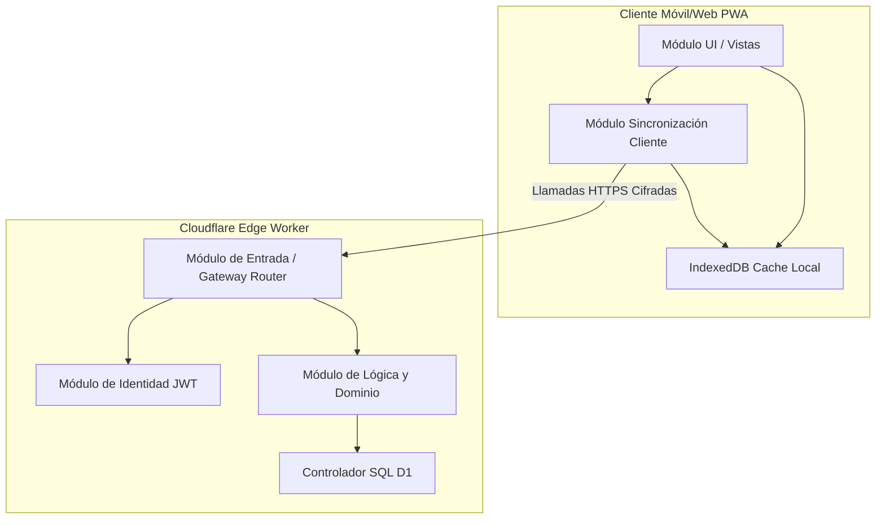

# 53_system_modularization_plan.md — Plan de Modularización del Sistema

Este documento establece la arquitectura física y lógica de los módulos de software constituyentes de la plataforma **Mi Despensa**. Define sus fronteras lógicas, interfaces de comunicación, dependencias técnicas unidireccionales y la topología de despliegue sobre la infraestructura Edge de Cloudflare.

---

## 1. Topología de Módulos y Flujo de Dependencias

Para evitar acoplamientos circulares y dependencias cruzadas inmanejables, el sistema se divide en capas con responsabilidades bien diferenciadas. Las dependencias fluyen estrictamente desde las capas superiores de interacción hacia las capas inferiores de persistencia y dominio.



---

## 2. Definición Detallada de Módulos

### A. Capa de Cliente (PWA Frontend)

#### 1. Módulo UI / Vistas
*   **Responsabilidad:** Renderizado de la interfaz gráfica a partir de un estado de datos reactivo y captura de interacciones de usuario (ej. clic en el botón "-1" de un artículo).
*   **Límites de diseño:**
    *   No tiene permitido interactuar directamente con la red ni con protocolos de transporte.
    *   Toda lectura y modificación se solicita a través del Módulo de Sincronización.
    *   El motor visual es agnóstico al mecanismo de sincronización subyacente.

#### 2. Módulo de Sincronización Cliente
*   **Responsabilidad:** Orquestar el flujo de datos local-remoto. Detecta cambios de conectividad, gestiona la cola de transacciones pendientes en la cola `outbox` e invoca la API HTTP del Edge Worker.
*   **Límites de diseño:**
    *   Aísla la UI de los estados transitorios de la red.
    *   Gestiona los reintentos exponenciales en caso de fallas transitorias de red.

#### 3. IndexedDB Cache Local
*   **Responsabilidad:** Almacenamiento no volátil en el sandbox del navegador web móvil del usuario. Guarda la última instantánea válida de la despensa de su hogar y la cola inmutable de eventos locales por enviar.

---

### B. Capa de Backend (Edge Worker)

#### 4. Módulo de Entrada (Gateway / Router)
*   **Responsabilidad:** Exponer los puntos de acceso HTTPS REST, realizar validaciones del formato de datos (JSON Schema validation) a nivel de la solicitud de entrada y encaminar la petición al controlador de dominio adecuado.
*   **Límites de diseño:**
    *   No procesa reglas de negocio directamente.
    *   Es el único componente que interactúa con la estructura HTTP (cookies, headers, códigos de estado).

#### 5. Módulo de Identidad y Acceso (JWT)
*   **Responsabilidad:** Parsear, descodificar y validar la firma de los tokens JWT adjuntos a las llamadas de API. Enriquecer el contexto de la ejecución del Worker con el `hogar_id` y `usuario_id` validados de forma segura.
*   **Límites de diseño:**
    *   Lanza excepciones inmediatas antes de que el router procese la lógica interna de negocio si el token es nulo o inválido.

#### 6. Módulo de Lógica de Negocio y Dominio
*   **Responsabilidad:** Implementar la lógica declarada en el modelo de dominio (agregados, entidades y reglas operativas). Garantiza que no se den violaciones a las invariantes del negocio (ej. el stock de un producto no puede ser inferior a cero).
*   **Límites de diseño:**
    *   Totalmente independiente del protocolo de transporte (HTTP) y del motor físico de base de datos.
    *   Recibe interfaces genéricas de almacenamiento que se resuelven en runtime.

#### 7. Controlador de Base de Datos D1
*   **Responsabilidad:** Traducir las intenciones de almacenamiento del dominio a consultas SQL crudas optimizadas para Cloudflare D1.
*   **Límites de diseño:**
    *   Es la única zona del código autorizada a ejecutar la API de Cloudflare Workers KV o bindings de D1 SQL.

---

## 3. Interfaces de Comunicación y Contratos de API (Contracts)

### Interfaz HTTP: CRUD y Stock de Productos

Toda llamada requiere la inclusión del encabezado HTTP `Authorization: Bearer <JWT>`.

#### 1. Obtener Inventario Completo
*   **Método:** `GET`
*   **Ruta:** `/api/v1/productos`
*   **Respuesta Exitosa (200 OK):**
```json
[
  {
    "id": "prod_87a9f91a",
    "nombre": "Leche Entera Conaprole 1L",
    "cantidad_actual": 3,
    "cantidad_minima": 1,
    "categoria": "Lácteos",
    "ultima_modificacion": "2026-06-15T02:00:00Z"
  }
]
```

#### 2. Actualizar Stock (Decremento Rápido / Incremento)
*   **Método:** `PATCH`
*   **Ruta:** `/api/v1/productos/:id/stock`
*   **Cuerpo de la Petición (Request Body):**
```json
{
  "variacion": -1,
  "client_timestamp": "2026-06-15T02:45:00Z"
}
```
*   **Respuesta Exitosa (200 OK):**
```json
{
  "id": "prod_87a9f91a",
  "cantidad_actual": 2,
  "evento_id": "evt_9b1a77f0"
}
```
*   **Respuesta por Validación de Negocio Fallida (422 Unprocessable Entity):**
```json
{
  "error": "INSUFFICIENT_STOCK",
  "message": "La variación solicitada provocaría un inventario negativo del artículo."
}
```

---

## 4. Gestión de Dependencias Técnicas y Límites de Aislamiento

1.  **Aislamiento de Persistencia:** Los componentes de dominio interactúan con la interfaz de almacenamiento abstracta `IInventarioRepository`. En runtime, el Worker inyecta el componente `D1InventarioRepository`, mientras que la suite de pruebas locales puede inyectar un mock en memoria `InMemoryInventarioRepository` sin modificar una sola línea de código del motor de negocio.
2.  **Validación de Fronteras Físicas:** No está permitido importar librerías de plataforma (ej. bindings de Cloudflare en `wrangler` o Node.js) dentro de los archivos ubicados en el subdirectorio de dominio técnico. Esto preserva la portabilidad completa ante la necesidad de migrar la lógica fuera del ecosistema de Cloudflare en fases futuras.
