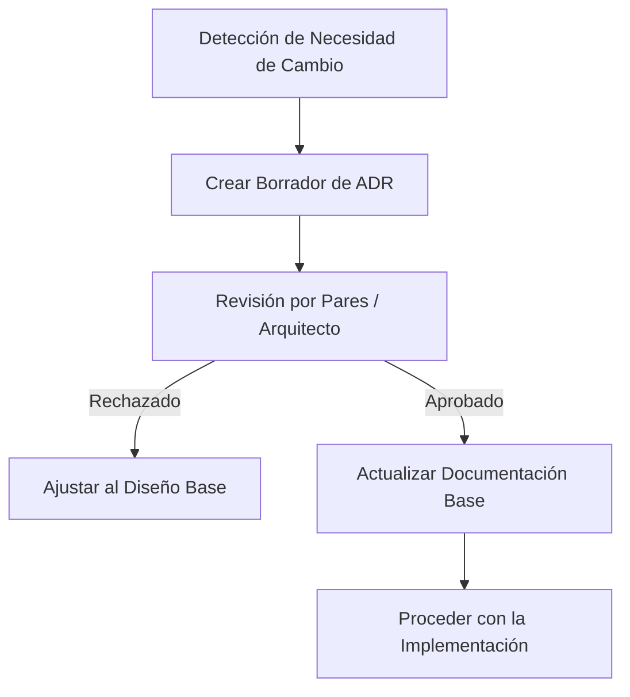

# 59_change_control_process.md — Proceso de Control de Cambios de Diseño

Este documento especifica el procedimiento formal para proponer, evaluar, aprobar e integrar cambios en las especificaciones de diseño y arquitectura de **Mi Despensa** durante el ciclo de vida del desarrollo de software.

---

## 1. Flujo de Gestión de Desviaciones Arquitectónicas

Cuando un desarrollador o un equipo de implementación detecta la necesidad de desviarse del diseño original (debido a limitaciones técnicas imprevistas del Edge, problemas de rendimiento o cambios de prioridad del negocio), se debe ejecutar el siguiente flujo estructurado:

1.  **Detección e Identificación:** El desarrollador identifica que el diseño base no puede cumplirse (ej. latencia excesiva en consultas anidadas en D1) y detiene la codificación en esa rama específica.
2.  **Formalización de la Propuesta (ADR):** Se crea una propuesta de cambio en formato markdown dentro del directorio del repositorio utilizando la estructura estandarizada de ADR (Contexto, Decisión, Consecuencias).
3.  **Evaluación de Impacto (Revisión):** La propuesta es evaluada en base a tres criterios obligatorios:
    *   *Costo:* ¿El cambio incrementa el costo operativo por encima del presupuesto de cero costo?
    *   *Seguridad:* ¿Se introducen nuevos vectores de ataque o vulnerabilidades lógicas de acceso?
    *   *Mantenibilidad:* ¿Afecta negativamente el aislamiento de los contextos acotados?
4.  **Aprobación e Integración:** Tras el consenso técnico, el ADR es marcado como `Approved` y se procede a actualizar la documentación de arquitectura afectada para evitar que los documentos queden obsoletos.

---

## 2. Actualización Segura del Sistema sin Interrupciones

Para actualizar el diseño y las APIs del sistema en desarrollo sin romper la compatibilidad con las versiones anteriores, se deben seguir los siguientes pasos técnicos:

*   **Versionado de APIs (Semantic Versioning):** Los endpoints expuestos en el Edge Worker deben incluir el prefijo de versión en la URL (ej. `/api/v1/...`). Si un cambio en el diseño requiere alterar la estructura de un JSON de respuesta, se debe crear la ruta `/api/v2/...` manteniendo la versión anterior operativa durante el periodo de transición.
*   **Depreciación Programada (Deprecation Lifecycle):**
    1.  Marcar la API anterior con el encabezado HTTP `Sunset` y emitir advertencias en las respuestas lógicas de desarrollo.
    2.  Monitorear a través de telemetría de logs (Cloudflare Analytics) que el volumen de llamadas a la versión antigua sea cero.
    3.  Eliminar físicamente el código obsoleto del Worker.
