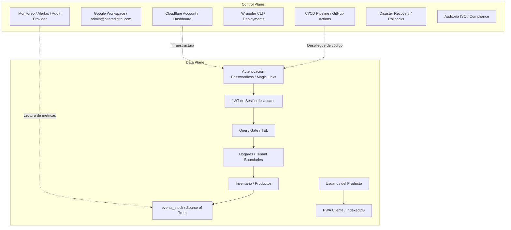

# 64_control_plane_architecture.md — Separación Formal Control Plane vs Data Plane

Este documento formaliza la separación arquitectónica entre el **Control Plane** (plano de control organizacional e infraestructura) y el **Data Plane** (plano de datos de dominio y producto) de la plataforma **Mi Despensa**.

---

## 1. Definición de Planos

### 1.1. Control Plane (Plano de Control)

El Control Plane comprende todas las funciones, identidades, servicios e infraestructura que **gobiernan, configuran, despliegan, monitorean y protegen** la plataforma, pero que **no participan en el flujo de datos del dominio de negocio**.

### 1.2. Data Plane (Plano de Datos)

El Data Plane comprende todas las funciones, identidades, datos y flujos que **materializan la lógica de negocio del producto Mi Despensa**: usuarios finales, hogares, inventario, eventos de stock, listas de compras y analytics de producto.

---

## 2. Arquitectura de Separación

---

## 3. Inventario de Componentes por Plano

### 3.1. Componentes del Control Plane

| Componente | Tipo | Propósito | Identidad Asociada |
| :--- | :--- | :--- | :--- |
| Cuenta Cloudflare | Infraestructura Cloud | Hosting de Workers, D1, R2 y DNS | admin@biteradigital.com |
| Google Workspace | Plataforma Corporativa | Correo corporativo y administración de dominio | admin@biteradigital.com |
| GitHub Repository | Gestión de Código | Control de versiones y CI/CD | admin@biteradigital.com |
| Wrangler CLI | Herramienta de Deployment | Despliegue y rollback de Workers | admin@biteradigital.com |
| Audit Evidence Provider | Abstracción de Logs | Evidencia de auditoría (D1 Audit Trail en MVP, Logpush a futuro) | admin@biteradigital.com |
| Resend / Email API | Servicio Transaccional | Envío de Magic Links (Free Tier) | no-reply@biteradigital.com |
| Variables de Entorno | Secrets Management | JWT_SECRET, ENCRYPTION_KEY_HEX | Dashboard Cloudflare |

### 3.2. Componentes del Data Plane

| Componente | Tipo | Propósito | Identidad Asociada |
| :--- | :--- | :--- | :--- |
| Workers API | Runtime de Aplicación | Ejecución de lógica de negocio | JWT del usuario |
| D1 Database | Persistencia Relacional | Almacenamiento de hogares, inventario, eventos | Aislado por hogar_id |
| R2 Storage | Almacenamiento de Objetos | Fotos de productos (futuro V1) | Aislado por hogar_id |
| IndexedDB (Cliente) | Cache Local | Cola offline y copia local de despensa | user_id local |
| Service Worker (PWA) | Cache de Assets | Stale-while-revalidate para assets estáticos | Navegador del usuario |
| Tabla `users` | Datos de Identidad | user_id, email_hash, email_encrypted | user_id |
| Tabla `hogares` | Tenant Boundary | Aislamiento multi-tenant | hogar_id |
| Tabla `inventario` | Materialized View | Stock consolidado para dashboard | hogar_id + product_id |
| Tabla `events_stock` | Source of Truth | Log inmutable de cambios de stock | hogar_id + actor_user_id |

---

## 4. Reglas de Aislamiento entre Planos

### 4.1. Reglas Absolutas

1. **No existen identidades compartidas.** `admin@biteradigital.com` pertenece exclusivamente al Control Plane. Nunca debe existir un registro en `users` con un hash SHA-256 de `admin@biteradigital.com`.

2. **No existen flujos de datos bidireccionales.** El Control Plane puede **leer métricas** del Data Plane (observabilidad), pero **nunca debe escribir datos de dominio** (inventario, eventos, hogares).

3. **No existen APIs compartidas.** Los endpoints de la API REST (`/api/v1/*`) pertenecen exclusivamente al Data Plane. Las operaciones de Control Plane se ejecutan a través de Wrangler CLI, Dashboard Cloudflare o APIs internas de administración.

4. **El JWT del Data Plane no otorga acceso al Control Plane.** Un token JWT de sesión de usuario no puede utilizarse para ejecutar operaciones de infraestructura (despliegue, rollback, migración).

5. **Las credenciales del Control Plane no otorgan acceso al Data Plane.** La API Key de Cloudflare o las credenciales de admin@biteradigital.com no otorgan acceso lógico a datos de hogares individuales a través de la API REST.

### 4.2. Puntos de Contacto Controlados

Los únicos puntos donde el Control Plane interactúa con el Data Plane son:

| Punto de Contacto | Dirección | Naturaleza | Control |
| :--- | :--- | :--- | :--- |
| Despliegue de código | Control → Data | Publicación de Worker compilado | Pipeline CI/CD con Gates |
| Migración de esquema D1 | Control → Data | Ejecución de SQL DDL | ADR obligatorio + revisión |
| Audit Evidence Provider | Data → Control | Persistencia de logs de auditoría (D1 / R2) | Sin PII directa, append-only |
| Envío de Magic Links | Control → Data | Email transaccional a usuario | API de Resend Free Tier |
| Backup D1 a R2 | Data → Control | Volcado SQL diario cifrado | Worker cron automatizado |
| Rollback de Worker | Control → Data | Restauración de versión previa | `wrangler rollback` manual |

---

## 5. Riesgos de Fuga entre Planos

| Riesgo | Gravedad | Descripción | Mitigación |
| :--- | :--- | :--- | :--- |
| **CP-DP-01** | CRÍTICA | admin@biteradigital.com se registra como usuario del producto | Validación en registro que rechace dominios corporativos del sistema |
| **CP-DP-02** | ALTA | Variables de entorno del Worker expuestas en logs de producción | Sanitización de logs: JWT_SECRET y ENCRYPTION_KEY_HEX nunca se loguean |
| **CP-DP-03** | ALTA | Un administrador de Cloudflare consulta D1 directamente sin Query Gate | Política operativa: toda consulta ad-hoc de D1 requiere registro de auditoría |
| **CP-DP-04** | MEDIA | Evidencia en Audit Trail contiene PII | Los logs del Worker solo registran user_id, nunca email desencriptado |
| **CP-DP-05** | MEDIA | Pipeline CI/CD ejecuta migraciones destructivas sin revisión | Gate 2 de Release Readiness exige aprobación manual para DDL |

---

## 6. Validación de Compliance

| Marco Regulatorio | Requisito | Cumplimiento |
| :--- | :--- | :--- |
| **GDPR Art 25** | Separación de datos administrativos y datos personales | ✅ Cubierto por la separación Control/Data Plane |
| **ISO 27001 A.5.15** | Control de acceso basado en necesidad de conocimiento | ✅ admin@biteradigital.com no tiene acceso lógico al Data Plane |
| **Ley 18.331 Art 9** | Seguridad en el tratamiento de datos | ✅ El Responsable del Tratamiento opera desde el Control Plane |
