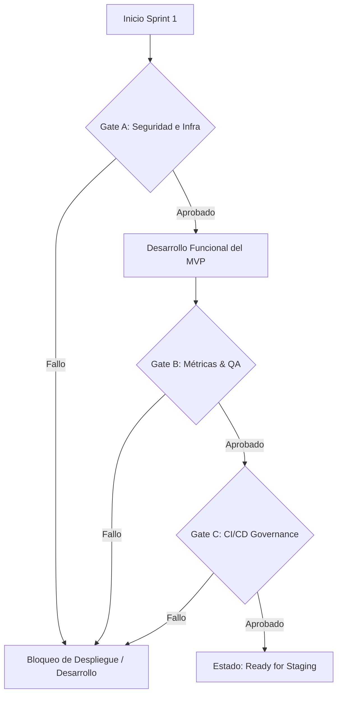

# 71_sprint_1_execution_contract.md — Contrato de Ejecución del Sprint 1

Este documento formaliza el contrato de calidad, seguridad y entrega para el **Sprint 1** de la plataforma **Mi Despensa**, operada por **Bitera Digital SAS**. Define los criterios de aceptación inquebrantables, los puntos de control obligatorios (**Gates**) y el alcance exacto para considerar el Sprint como completado y listo para Staging.

---

## 1. Estructura de Gates de Calidad y Seguridad

Para evitar que dependencias arquitectónicas críticas queden rezagadas durante el desarrollo de características, el Sprint 1 se divide en fases condicionadas por **Decision Gates**:



### 1.1. Gate A: Infraestructura de Entrada y Registro (Obligatorio)
El desarrollo de cualquier interfaz de usuario o lógica de negocio secundaria está condicionado a la aprobación técnica de esta puerta de enlace:

*   ** GAP-01: Autenticación Real por Magic Link (Resend):**
    *   *Criterio:* Reemplazar el simulador de consola por la integración real con la API de Resend utilizando el plan gratuito (Costo USD 0).
    *   *Verificación:* Flujo completo de extremo a extremo: `Usuario introduce email` → `Envío de email con token temporal firmado` → `Verify callback` → `Emisión de JWT de sesión` validado.
*   ** GAP-02: Audit Trail e Integridad (auditoria_legal):**
    *   *Criterio:* Crear físicamente la tabla `auditoria_legal` en D1 (conforme a `schema/d1-schema.sql`) e implementar la abstracción `Audit Evidence Provider` (`D1 Audit Trail`).
    *   *Verificación:* Cada solicitud de Magic Link, inicio de sesión exitoso/fallido e intento de evasión del TEL debe quedar guardado de forma inalterable y auditable en la tabla.

### 1.2. Gate B: Métricas de Rendimiento y Código (Obligatorio)
Antes de declarar el fin de Sprint 1, el código debe satisfacer los siguientes umbrales:

*   **Cobertura de Testing:** Cobertura de pruebas unitarias y de integración sobre el Edge Worker y middleware superior o igual al **85%**.
*   **Vulnerabilidades:** 0 reportes de vulnerabilidades críticas o altas en el análisis estático de dependencias npm.
*   **Lighthouse Score:** Puntuación Lighthouse en móviles superior o igual a **95** en Rendimiento y Accesibilidad para la PWA.
*   **Velocidad de Carga:** LCP (Largest Contentful Paint) menor a **1.5 segundos** en redes móviles simuladas.

### 1.3. Gate C: CI/CD Governance (Obligatorio)
Garantiza el control de calidad, seguridad y cumplimiento documental de forma automatizada mediante el orquestador del plano de control del ciclo de vida:

*   **CI Pipeline Requisitos:** Ejecutar de forma automática en cada Pull Request:
    *   TypeScript Build (compilación sin errores).
    *   Pruebas Unitarias y de Integración con reporte de cobertura.
    *   `npm audit` para verificación de dependencias.
    *   Validación de Arquitectura y Cumplimiento (detección de drifts en `wrangler.toml` o configuraciones costosas).
    *   Validación de consistencia documental.
*   **Políticas de Bloqueo de Merge:** Se bloquea el merge a `develop` o `main` si:
    *   La cobertura de testing es inferior al **85%**.
    *   Se encuentra 1 o más vulnerabilidades de severidad alta o crítica (`High Vulnerabilities > 0`).
    *   Ocurre algún fallo en la compilación o pruebas (`Build Failure`).
    *   Se detecta drift arquitectónico (bindings o servicios con costo comercial activo).

---

## 2. Entregable Funcional Final (User Flow E2E)

El Sprint 1 se considerará completado cuando se pueda ejecutar con éxito el siguiente flujo productivo integrado en el entorno de desarrollo y validado por tests automáticos:

```
[Usuario]
   │
   ├─► 1. Solicita Login (Magic Link Real vía Resend)
   ├─► 2. Recibe correo electrónico, hace clic en el enlace de verificación
   ├─► 3. Recibe token JWT en navegador y se almacena localmente
   ├─► 4. Crea un nuevo Hogar (asociando su UUID como owner)
   ├─► 5. Agrega un Producto (ej. "Leche", delta = +3 unidades)
   │     └─► Transacción D1: Inserta events_stock (ADD) + Inserta/Update inventario
   ├─► 6. Consume un Producto (ej. "Leche", delta = -1 unidad)
   │     └─► Transacción D1: Inserta events_stock (REMOVE) + Update inventario
   ├─► 7. Visualiza Historial (Consulta events_stock para validar deltas)
   └─► 8. Consulta Auditoría (Verificación de los registros en auditoria_legal)
```

---

## 3. Definición de Hecho (Definition of Done - DoD)

El estado final esperado del Sprint es **Sprint 1 Ready for Staging**. Para alcanzar este estado se exige:

1.  **Código Compilado y Validado:** Sin errores de compilación TypeScript.
2.  ** TEL Activo:** Verificación automatizada de que no existen consultas directas a D1 que evadan el interceptor de `hogar_id`.
3.  **Secrets en Cloudflare Protegidos:** Las claves de Resend y cifrado AES-GCM residen exclusivamente como secretos de Cloudflare Worker en producción.
4.  **Aprobación del Comportamiento Offline:** El Service Worker responde correctamente ante cortes de red simulados en Chrome DevTools, encolando las acciones en IndexedDB y resincronizándolas al volver al estado online.
5.  **Aprobación Operativa:** Reporte de alineación y gap actualizado, firmado y subido al Control Plane.
