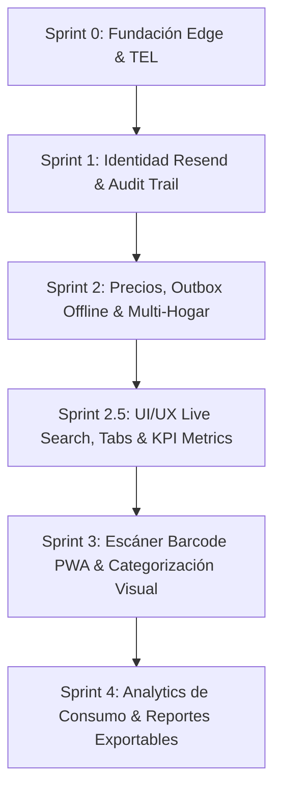

# 82_sprint_roadmap_master_plan.md — Roadmap Maestro de Sprints y Visión de Producto V1+

Este documento formaliza la trazabilidad histórica, el estado actual y la hoja de ruta (**Roadmap Maestro**) de la plataforma **Mi Despensa**, alineando los requerimientos de arquitectura, calidad de código y las metas de experiencia de usuario (**UI/UX**) bajo la gobernanza de **Bitera Digital SAS**.

---

## 1. Matriz de Estado Histórico y Progreso de Sprints

| Sprint / Slice | Alcance de Requerimientos | Estado Físico | Gates & Calidad | Entregables Clave |
| :--- | :--- | :---: | :---: | :--- |
| **Sprint 0** | Cimientos Base + TEL Query Gate + Router Worker + SW PWA | **✅ Completado** | Pass | `0001_init_schema.sql`, `D1QueryGate`, Auth JWT, SW PWA |
| **Sprint 0.5** | FTUE Session Reconciliation & Event Immutability | **✅ Completado** | Pass | `SessionModule` Idempotente, ADR-002, ADR-003, `check-architecture.js` |
| **Sprint 1 (Gate A)** | Login Real (Resend API) + Audit Evidence Provider | **✅ Completado** | Pass | `sendMagicLink` Resend API, `consumed_tokens`, `auditoria_legal` HMAC-SHA256 |
| **Sprint 1 (Hito 1-3)** | Stock Mínimo + Local Outbox Queue + `/api/v1/shopping-list` | **✅ Completado** | Pass | `min_stock` D1/IndexedDB, `sync.js` Outbox, Badge '⚠️ Recomprar', Endpoint Compras |
| **Sprint 2 (Slice 4b)** | Historial de Precios + Bitácora D1 + Modal UI + Multimoneda | **✅ Completado** | Pass | Tabla `historial_precios`, `/api/v1/prices`, Selector Multimoneda (default UYU), Modal PWA |
| **Sprint 2.5 (UI/UX)** | Filtros por Pestaña + Buscador Instantáneo + KPI Dashboard Cards | **✅ Completado** | Pass | Tabs (Todos/Recomprar), Live Search Bar, Tarjetas KPI Resumen (Total e Ítems Bajos) |
| **Sprint 2.6 (Hogares)**| Unión a Hogares Compartidos (Código de Invitación / QR) | **✅ Completado** | Pass | Endpoint `/api/v1/hogar/join`, Código de Invitación copiable, Flujo Multi-Usuario |
| **Sprint 3 (Epic 2)** | Categorización Visual y Organización por Pasillo (D1 & PWA) | **✅ Completado** | Pass | Columna `category` en D1, Pinta de Píldoras de Filtro por Pasillo, Insignia de Categoría en PWA |
| **Sprint 3 (Epic 1)** | Escáner de Códigos de Barra en PWA (`UI/UX Barcode Scanner`) | ⏳ **En progreso** | Pending | Integración Barcode Detector API |
| **Sprint 4 (Próximo)** | Reportes de Consumo Doméstico + Exportación CSV/PDF | ⏳ **Planificado** | Pending | Gráficas de Tendencia de Gasto y consumo mensual de alacena |

---

## 2. Mapa Estratégico de Construcción por Slices

---

## 3. Plan Detallado del Sprint 3 (Próxima Fase UI/UX)

### 🎯 Objetivo del Sprint 3
Enriquecer significativamente la usabilidad táctil y móvil de la PWA agregando reconocimiento de códigos de barra mediante la cámara del smartphone y categorización visual intuitiva de los alimentos y productos del hogar.

### 📝 Epics & Historias de Usuario

#### Epic 1: Escáner de Códigos de Barra en PWA (`UI/UX Barcode Scanner`)
* **Historia:** Como usuario en el supermercado o en la cocina, quiero escanear el código de barras de un producto desde la cámara de mi teléfono para buscarlo o agregarlo instantáneamente sin escribir.
* **Criterios de Aceptación:**
  1. Uso de la API nativa de JavaScript `BarcodeDetector` (con fallback de librerías ultralivianas sin dependencias pesadas).
  2. Botón flotante `📷 Escanear` en la barra de producto.
  3. Autocompletado del nombre del producto y actualización inmediata de stock.

#### Epic 2: Categorización Visual y Organización por Pasillo (`Product Categorization`)
* **Historia:** Como miembro del hogar, quiero clasificar los productos por categoría (ej. *Lácteos, Limpieza, Bebidas, Almacén*) para visualizar la alacena organizada como un supermercado.
* **Criterios de Aceptación:**
  1. Selector de categoría en el alta del producto.
  2. Filtros de pasillo/categoría en el Dashboard principal de la PWA.
  3. Código de colores e íconos distintivos por categoría.

---

## 4. Gobernanza y Métricas Inquebrantables de Calidad

* **Costo Operativo:** Strict **USD 0** (Sin servicios comerciales pagos, sin Cron Jobs desatendidos).
* **Cobertura de Código:** Cobertura de pruebas unitarias en el Edge Worker **>= 85%**.
* **Arquitectura:** 0 violaciones detectadas por `node ./scripts/check-architecture.js`.
* **TypeScript:** Compilación limpia con 0 errores `npx tsc`.
