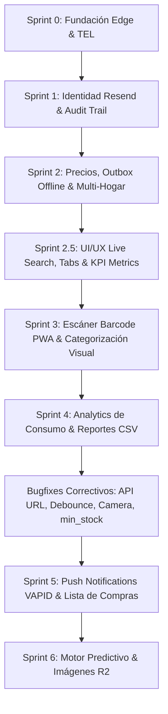

# 82_sprint_roadmap_master_plan.md — Roadmap Maestro de Sprints y Visión de Producto V1+

Este documento formaliza la trazabilidad histórica, el estado actual y la hoja de ruta (**Roadmap Maestro**) de la plataforma **Mi Despensa**, alineando los requerimientos de arquitectura, calidad de código y las metas de experiencia de usuario (**UI/UX**) bajo la gobernanza de **Bitera Digital SAS**.

> **Última actualización:** 2026-07-31 — Sprint 5 completado + 4 bugfixes correctivos. Sprint 6 planificado.

---

## 1. Matriz de Estado Histórico y Progreso de Sprints

| Sprint / Slice | Alcance de Requerimientos | Estado Físico | Gates & Calidad | Entregables Clave |
| :--- | :--- | :---: | :---: | :--- |
| **Sprint 0** | Cimientos Base + TEL Query Gate + Router Worker + SW PWA | **✅ Completado** | Pass | `0001_init_schema.sql`, `D1QueryGate`, Auth JWT, SW PWA |
| **Sprint 0.5** | FTUE Session Reconciliation & Event Immutability | **✅ Completado** | Pass | `SessionModule` Idempotente, ADR-002, ADR-003, `check-architecture.js` |
| **Sprint 1 (Gate A)** | Login Real (Resend API) + Audit Evidence Provider | **✅ Completado** | Pass | `sendMagicLink` Resend API, `consumed_tokens`, `auditoria_legal` HMAC-SHA256 |
| **Sprint 1 (Hito 1-3)** | Stock Mínimo + Local Outbox Queue + `/api/v1/shopping-list` | **✅ Completado** | Pass | `min_stock` D1/IndexedDB, `sync.js` Outbox, Badge '⚠️ Recomprar', Endpoint Compras |
| **Sprint 2 (Slice 4b)** | Historial de Precios + Bitácora D1 + Modal UI + Multimoneda | **✅ Completado** | Pass | Tabla `historial_precios`, `/api/v1/prices`, Selector Multimoneda (default UYU), Modal PWA |
| **Sprint 2.5 (UI/UX)** | Filtros por Pestaña + Buscador Instantáneo + KPI Dashboard Cards | **✅ Completado** | Pass | Tabs (Todos/Recomprar), Live Search Bar, Tarjetas KPI Resumen (Total e Ítems Bajos) |
| **Sprint 2.6 (Hogares)**| Unión a Hogares Compartidos (Código de Invitación / QR) | **✅ Completado** | Pass | Endpoint `/api/v1/hogar/join`, Código de Invitación copiable, Flujo Multi-Usuario |
| **Sprint 3 (Epic 2)** | Categorización Visual y Organización por Pasillo (D1 & PWA) | **✅ Completado** | Pass | Columna `category` en D1 remota (migración), Pills de filtro por pasillo, Badge de categoría |
| **Sprint 3 (Epic 1)** | Escáner de Códigos de Barra en PWA (`UI/UX Barcode Scanner`) | **✅ Completado** | Pass | `barcode.js` BarcodeDetector API, Modal Viewfinder, Fallback elegante para browsers sin soporte |
| **Sprint 4 (Analytics)** | Reportes de Consumo Doméstico + Exportación CSV | **✅ Completado** | Pass | `analytics.js` Canvas bar chart, Top Productos ranking, Resumen por categoría, CSV con BOM, Nav tabs Inventario/Reportes, KPI Valor Stock |
| **Bugfixes Correctivos** | API_BASE URL, +/- debounce, Barcode camera selector, min_stock=0 | **✅ Completado** | Pass | `sync.js` URL fixed, debounce 800ms, `barcode.js` rewritten, form min=0 |
| **Sprint 5** | Push Notifications VAPID + Lista de Compras Inteligente + Web Share | **✅ Completado** | Pass | `push.ts` VAPID endpoints, Cron diario D1, `push_subscriptions`, Lista por categoría con precios, checkbox restock, Web Share API |
| **Sprint 6 (Próximo)** | Motor Predictivo de Agotamiento + Imágenes de Productos (R2) | ⏳ **Planificado** | Pending | Modelo de predicción por historial de consumo, Cloudflare R2 para imágenes |

---

## 2. Mapa Estratégico de Construcción por Slices

---

## 3. Plan Detallado del Sprint 4 (Completado)

### 🎯 Objetivo del Sprint 4
Dar visibilidad al usuario sobre el estado real de su alacena: cuánto gasta por categoría, qué productos tiene en mayor cantidad y exportar el inventario para uso externo.

### 📝 Entregables

#### Epic 1: Analytics de Consumo Doméstico
* Gráfico de barras animado (Canvas API nativo, 0 dependencias) con **gasto estimado por categoría**.
* **Top 6 productos** con mayor stock en ranking con barras de progreso y medallas.
* **Resumen por categoría**: count de productos, unidades totales y valor estimado.
* Tarjeta KPI **"Valor Stock"** en el header del dashboard (total de unidades).
* Navegación por **tabs Inventario / Reportes** en el dashboard principal.

#### Epic 2: Exportación CSV
* Botón "Descargar Inventario CSV" en el panel de Reportes.
* Archivo con BOM UTF-8 para compatibilidad con Excel y LibreOffice.
* Columnas: Producto, Categoría, Cantidad, Stock Mínimo, Última Actualización.
* Nombre del archivo con fecha actual (`midespensa-inventario-YYYY-MM-DD.csv`).

#### Correcciones Técnicas Incluidas
* Migración D1 remota: columnas `category` y `min_stock` aplicadas en Cloudflare.
* Service Worker bumped a `v4` con `analytics.js` en caché offline.

---

## 4. Plan del Sprint 5 (Próxima Fase)

### 🎯 Objetivo del Sprint 5
Convertir Mi Despensa en una herramienta **proactiva**: que le avise al usuario cuando debe comprar y le facilite la lista de compras organizada.

### 📝 Epics Planificadas

#### Epic 1: Notificaciones Push de Stock Bajo
* Registrar Service Worker Push Subscription via **Web Push API** (VAPID).
* Worker de Cloudflare envía notificación cuando algún producto cruza el umbral `min_stock`.
* Opción de configurar horario preferido de notificación (mañana / noche).
* Costo: **USD 0** usando Cloudflare Workers + Scheduled Triggers.

#### Epic 2: Lista de Compras Inteligente
* Endpoint `/api/v1/shopping-list` ya existente → enriquecerlo con historial de precios.
* Vista dedicada de Lista de Compras con:
  - Agrupación por categoría (simula recorrido por pasillo del súper).
  - Precio de referencia del último registro.
  - Checkbox de "ya lo compré" → actualiza stock automáticamente.
* Compartir lista vía Web Share API (link o texto plano).

---

## 5. Gobernanza y Métricas Inquebrantables de Calidad

| Dimensión | Meta | Estado actual |
| :--- | :---: | :---: |
| **Costo Operativo** | USD 0 | ✅ |
| **Cobertura de Tests** | ≥ 85% (89 tests, 11 suites) | ✅ |
| **Arquitectura** | 0 violaciones `check-architecture.js` | ✅ |
| **TypeScript** | 0 errores `tsc` | ✅ |
| **Sync Badge** | Sin error en producción | ✅ (D1 migrada) |
| **API URL** | workers.dev correctamente configurado | ✅ (bugfix) |
| **Cron Trigger** | Activo `0 11 * * *` en producción | ✅ |

---

## 6. Historial de Commits Significativos

| Commit | Descripción |
| :--- | :--- |
| `a4314dd` | docs(roadmap): Sprint 3 completamente cerrado |
| `59cd372` | feat(sprint-3-epic-1): Barcode Scanner PWA + BarcodeDetector API |
| `b6a5b74` | feat(sprint-3-epic-2): Categorización visual + D1 category column |
| `6e79ed3` | feat(sprint-4): Analytics Canvas, CSV Export, nav tabs, KPI |
| `22cd349` | docs(sprint-4): Roadmap + backlog + informe de ejecución Sprint 4 |
| `8f1ea40` | feat(sprint-5): Push VAPID, Lista Compras, 4 bugfixes, cron diario |

---

*Documento vivo — actualizarlo en cada cierre de sprint. Fuente de verdad del roadmap del producto.*
